# HMS Foundation — Standard Operating Procedures (SOP)
**Document Version:** 1.0  
**Platform:** HMS Foundation — Hotel Management System  
**Prepared By:** Reverse-engineered from UI screenshots  
**Last Updated:** April 2026  
**Classification:** Internal Operational Reference

---

## Table of Contents

### Part A — Platform Overview
- [A1. Application Identity & Architecture](#a1-application-identity--architecture)
- [A2. Screenshot Inventory](#a2-screenshot-inventory)
- [A3. Role Map](#a3-role-map)
- [A4. Navigation Map](#a4-navigation-map)

### Part B — Super Admin SOPs (ATC Admin Panel)
- [SOP-SA-01: Logging In to the Platform](#sop-sa-01-logging-in-to-the-platform)
- [SOP-SA-02: Reading the Super Admin Business Overview Dashboard](#sop-sa-02-reading-the-super-admin-business-overview-dashboard)
- [SOP-SA-03: Browsing and Searching the Hotels Registry](#sop-sa-03-browsing-and-searching-the-hotels-registry)
- [SOP-SA-04: Onboarding a New Hotel](#sop-sa-04-onboarding-a-new-hotel)
- [SOP-SA-05: Viewing Hotel Details — Overview Tab](#sop-sa-05-viewing-hotel-details--overview-tab)
- [SOP-SA-06: Viewing Hotel Details — System Info Tab](#sop-sa-06-viewing-hotel-details--system-info-tab)
- [SOP-SA-07: Viewing Hotel Details — Invoices Tab](#sop-sa-07-viewing-hotel-details--invoices-tab)
- [SOP-SA-08: Editing Hotel Details](#sop-sa-08-editing-hotel-details)
- [SOP-SA-09: Suspending or Deleting a Hotel](#sop-sa-09-suspending-or-deleting-a-hotel)
- [SOP-SA-10: Impersonating a Hotel Admin (Login as Admin)](#sop-sa-10-impersonating-a-hotel-admin-login-as-admin)
- [SOP-SA-11: Managing Subscription Plans (Product Catalog)](#sop-sa-11-managing-subscription-plans-product-catalog)
- [SOP-SA-12: Creating a New Subscription Plan](#sop-sa-12-creating-a-new-subscription-plan)
- [SOP-SA-13: Viewing the Subscription Hub](#sop-sa-13-viewing-the-subscription-hub)
- [SOP-SA-14: Managing Platform Users (Access Control)](#sop-sa-14-managing-platform-users-access-control)
- [SOP-SA-15: Editing a Platform User Identity](#sop-sa-15-editing-a-platform-user-identity)
- [SOP-SA-16: Managing System Roles and Permission Matrix](#sop-sa-16-managing-system-roles-and-permission-matrix)
- [SOP-SA-17: Exporting Reports from the Intelligence Hub](#sop-sa-17-exporting-reports-from-the-intelligence-hub)
- [SOP-SA-18: Viewing a Report Detail (Hotels Registry Export)](#sop-sa-18-viewing-a-report-detail-hotels-registry-export)
- [SOP-SA-19: Managing Helpdesk Support Tickets (Super Admin)](#sop-sa-19-managing-helpdesk-support-tickets-super-admin)
- [SOP-SA-20: Editing Super Admin Account Settings](#sop-sa-20-editing-super-admin-account-settings)

### Part C — Hotel Admin SOPs (HMS Hotel Panel)
- [SOP-HA-01: Reading the Hotel Admin Property Overview Dashboard](#sop-ha-01-reading-the-hotel-admin-property-overview-dashboard)
- [SOP-HA-02: Managing Room Types](#sop-ha-02-managing-room-types)
- [SOP-HA-03: Adding a New Room Type](#sop-ha-03-adding-a-new-room-type)
- [SOP-HA-04: Managing Guest Bookings](#sop-ha-04-managing-guest-bookings)
- [SOP-HA-05: Viewing Occupancy Analysis Reports](#sop-ha-05-viewing-occupancy-analysis-reports)
- [SOP-HA-06: Managing the Billing & Commercial Ecosystem](#sop-ha-06-managing-the-billing--commercial-ecosystem)
- [SOP-HA-07: Managing the FAQ Knowledge Base](#sop-ha-07-managing-the-faq-knowledge-base)
- [SOP-HA-08: Adding a New FAQ Entry](#sop-ha-08-adding-a-new-faq-entry)
- [SOP-HA-09: Managing Hotel Staff — Users & Roles (Team Sovereignty)](#sop-ha-09-managing-hotel-staff--users--roles-team-sovereignty)
- [SOP-HA-10: Configuring Access Roles & Permission Matrix (Hotel)](#sop-ha-10-configuring-access-roles--permission-matrix-hotel)
- [SOP-HA-11: Configuring Hotel Settings (Kiosk Support Contacts)](#sop-ha-11-configuring-hotel-settings-kiosk-support-contacts)
- [SOP-HA-12: Raising a Support Ticket to the Platform Team](#sop-ha-12-raising-a-support-ticket-to-the-platform-team)
- [SOP-HA-13: Editing Hotel Admin Staff Profile](#sop-ha-13-editing-hotel-admin-staff-profile)

### Part D — Appendix
- [Appendix A: Inferred Gaps (No Screenshots Available)](#appendix-a-inferred-gaps-no-screenshots-available)
- [Appendix B: Glossary of Terms](#appendix-b-glossary-of-terms)

---

## Part A — Platform Overview

### A1. Application Identity & Architecture

| Field | Value |
|---|---|
| **Platform Name** | HMS Foundation |
| **Application Type** | Multi-tenant SaaS Hotel Management System (HMS) |
| **Primary Domains** | Super Admin Panel (ATC Admin) · Hotel Admin Panel (HMS Hotel) |
| **Technology Stack** | Next.js (React) · FastAPI (Python) · PostgreSQL · Docker |
| **Authentication** | Email + Password (unified login page, role-based redirect) |
| **Design System** | Dark UI · Orange (#F97316) accent · Sans-serif modernist typography |
| **Currency** | INR (₹) |
| **Timezone** | Asia/Kolkata (IST) — locked at platform level |

**Platform Description:**  
HMS Foundation is a two-tier, multi-tenant hotel management SaaS platform. A single login page (`/`) authenticates users and routes them to one of two distinct admin consoles based on their role. The **Super Admin** (branded "ATC Admin") manages the entire hotel ecosystem — onboarding hotels, defining subscription plans, handling billing, and overseeing platform-level support. Each hotel has its own **Hotel Admin** workspace (branded "HMS Hotel") from which hotel staff manage rooms, guests/bookings, billing, FAQs, staff RBAC, and kiosk support settings.

---

### A2. Screenshot Inventory

#### Super Admin Screenshots (15 files — `HMS_SS/SuperAdmin/`)

| # | File | Page / Context |
|---|---|---|
| 1 | `Login-Page.png` | Shared login page — HMS Foundation |
| 2 | `Dashboard-Page.png` | Super Admin — Business Overview Dashboard |
| 3 | `Hotel-List_Page.png` | Super Admin — Hotels Registry (card view) |
| 4 | `Hotels-Detail_Overview_Tab.png` | Super Admin — Hotel Detail: Overview Tab (scroll top) |
| 5 | `Hotels-Detail_Overview_Tab_2.png` | Super Admin — Hotel Detail: Overview Tab (scroll bottom — Property Photos + Danger Zone) |
| 6 | `Hotels-Detail_System_Tab.png` | Super Admin — Hotel Detail: System Info Tab |
| 7 | `Hotels-Detail_Invoice_Tab.png` | Super Admin — Hotel Detail: Invoices Tab |
| 8 | `Hotels-Edit_Modal.png` | Super Admin — Edit Hotel Details Modal |
| 9 | `Plans-Page.png` | Super Admin — Product Catalog (Plans) |
| 10 | `Plans-Edit_Modal.png` | Super Admin — Define New Offering (Side Panel) |
| 11 | `Subscription-Page.png` | Super Admin — Subscription Hub |
| 12 | `Roles-Page.png` | Super Admin — Access Control: System Roles Tab |
| 13 | `Roles-Permission_Matrix.png` | Super Admin — Role Permission Matrix |
| 14 | `User-Page.png` | Super Admin — Access Control: Users Registry Tab |
| 15 | `Users-Edit_Modal.png` | Super Admin — Modify Identity Modal |
| 16 | `Reports-Page.png` | Super Admin — Intelligence Hub (Reports) |
| 17 | `Reports-Detail_View.png` | Super Admin — Hotels Registry Detail Report |
| 18 | `HelpDesk-Page.png` | Super Admin — Support Center |
| 19 | `Profile-Page.png` | Super Admin — Account Settings |

#### Hotel Admin Screenshots (14 files — `HMS_SS/HotelAdmin/`)

| # | File | Page / Context |
|---|---|---|
| 20 | `Dashboard-Page.png` | Hotel Admin — Property Overview Dashboard |
| 21 | `Rooms-Page.png` | Hotel Admin — Room Types Definition |
| 22 | `Guest-Page.png` | Hotel Admin — Guest / Bookings List |
| 23 | `Reports-DetailPage.png` | Hotel Admin — Occupancy Analysis Report |
| 24 | `Billing-Page.png` | Hotel Admin — Commercial Ecosystem (Billing) |
| 25 | `FAQ-Page.png` | Hotel Admin — FAQ Knowledge Base |
| 26 | `FAQs-Modal.png` | Hotel Admin — Add FAQ Modal |
| 27 | `Roles-Page.png` | Hotel Admin — Team Sovereignty: Access Roles Tab |
| 28 | `Roles-Permission_Matrix.png` | Hotel Admin — Role Permission Matrix |
| 29 | `User-Page.png` | Hotel Admin — Team Sovereignty: Staff Registry Tab |
| 30 | `Settings-Page.png` | Hotel Admin — Hotel Settings (Kiosk Support Contacts) |
| 31 | `Support-Page.png` | Hotel Admin — Support Helpdesk |
| 32 | `Support-New_Ticket_Modal.png` | Hotel Admin — Raise New Ticket Modal |
| 33 | `Profile-Page.png` | Hotel Admin — My Profile (Staff Profile & Preferences) |

---

### A3. Role Map

| Role | Panel Brand | Login Redirect | Scope |
|---|---|---|---|
| **Super Admin** | ATC Admin | Super Admin dashboard | Platform-wide: all hotels, plans, subscriptions, users, reports, support |
| **Hotel Admin / General Manager** | HMS Hotel | Hotel Admin dashboard | Single hotel: rooms, guests, billing, FAQs, staff, settings, support |
| **Hotel Staff** | HMS Hotel | (Same panel, restricted RBAC) | Subset of Hotel Admin modules, controlled by permission matrix |

**Super Admin Navigation (left sidebar — ATC Admin):**
- **MAIN:** Dashboard · Hotels · Reports
- **FINANCE:** Plans · Subscriptions
- **SUPPORT:** Helpdesk
- **SETTINGS:** Platform Users

**Hotel Admin Navigation (left sidebar — HMS Hotel):**
- **OPERATIONS:** Dashboard · Rooms · Guests · Reports
- **MANAGEMENT:** Users & Roles · Billing · FAQs · Settings
- **SUPPORT:** Help & Support

---

### A4. Navigation Map

```
/ (Login)
├── Super Admin Panel (ATC Admin)
│   ├── /super/dashboard               → Business Overview Dashboard
│   ├── /super/hotels                  → Hotels Registry
│   │   └── /super/hotels/[id]         → Hotel Detail (Overview / System Info / Invoices tabs)
│   ├── /super/reports                 → Intelligence Hub
│   │   └── /super/reports/[type]      → Report Detail (Hotels / Subscriptions / Invoices / Users)
│   ├── /super/plans                   → Product Catalog
│   ├── /super/subscriptions           → Subscription Hub
│   ├── /super/helpdesk                → Support Center
│   ├── /super/platform-users          → Access Control (Users Registry + System Roles + Permission Matrix)
│   └── /super/profile                 → Account Settings
│
└── Hotel Admin Panel (HMS Hotel)
    ├── /hotel/dashboard               → Property Overview Dashboard
    ├── /hotel/rooms                   → Room Types Definition
    ├── /hotel/guests                  → Guest / Bookings List
    ├── /hotel/reports                 → Reports (Occupancy Analysis + Export)
    ├── /hotel/billing                 → Commercial Ecosystem
    ├── /hotel/faqs                    → FAQ Knowledge Base
    ├── /hotel/users-roles             → Team Sovereignty (Staff Registry + Access Roles + Permission Matrix)
    ├── /hotel/settings                → Hotel Settings (Kiosk Support Contacts)
    ├── /hotel/support                 → Support Helpdesk
    └── /hotel/profile                 → My Profile
```

---

## Part B — Super Admin SOPs

---

### SOP-SA-01: Logging In to the Platform

| Field | Value |
|---|---|
| **SOP ID** | SOP-SA-01 |
| **Role** | Any (Super Admin or Hotel Admin) |
| **Trigger** | User opens the HMS Foundation platform URL |

#### Screenshot Overview
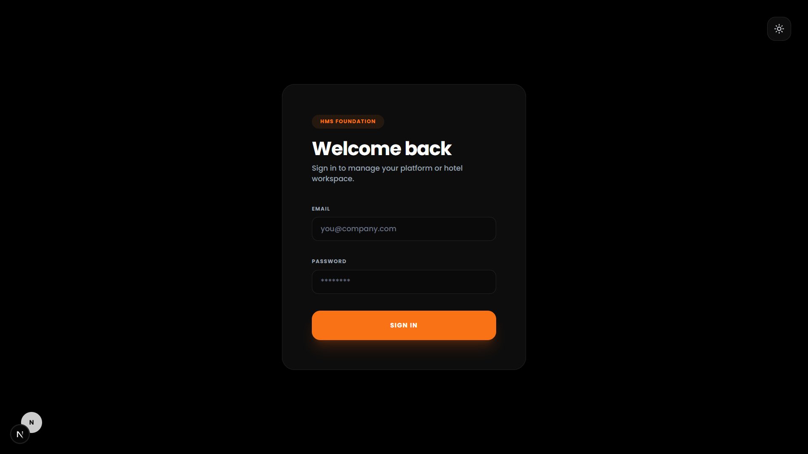

#### Purpose
Authenticate a user into the HMS Foundation platform and be routed to the correct admin console based on their assigned role.

#### Pre-conditions
- Valid email address registered in the system  
- Known password  
- Platform URL accessible in the browser

#### Step-by-Step Procedure

| Step | Action | Expected Result |
|---|---|---|
| 1 | Navigate to the platform URL in your browser. | The HMS Foundation login page loads. The dark-themed card displays the **HMS FOUNDATION** badge, "Welcome back" heading, and the subtitle: *"Sign in to manage your platform or hotel workspace."* |
| 2 | In the **EMAIL** field, enter your registered work email (e.g., `admin@atc.com` or `manager@hotel.com`). | The email field is populated. |
| 3 | In the **PASSWORD** field, enter your account password. | Password is masked with dots. |
| 4 | Click the orange **SIGN IN** button. | The system authenticates the credentials. |
| 5a | *(If Super Admin)* — Redirected to `/super/dashboard`. | The ATC Admin panel loads with the Business Overview Dashboard. |
| 5b | *(If Hotel Admin/Staff)* — Redirected to `/hotel/dashboard`. | The HMS Hotel panel loads with the Property Overview Dashboard. |
| 6 | *(On failure)* — If credentials are invalid, an inline error is displayed. | Re-enter correct credentials and retry. |

#### Notes
- The login page has a **theme toggle** (sun icon, top-right) to switch between dark and light modes.  
- A single login URL serves both Super Admin and Hotel Admin roles — role-based routing is automatic.  
- There is no "Forgot Password" link visible in the screenshot; contact Super Admin for password resets.

---

### SOP-SA-02: Reading the Super Admin Business Overview Dashboard

| Field | Value |
|---|---|
| **SOP ID** | SOP-SA-02 |
| **Role** | Super Admin |
| **Trigger** | Super Admin logs in or clicks "Dashboard" in the left sidebar |

#### Screenshot Overview
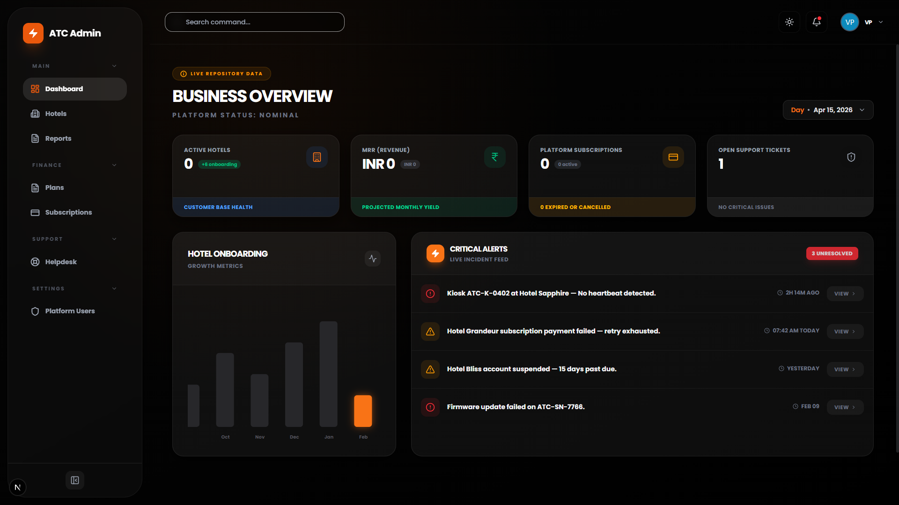

#### Purpose
Understand the real-time health of the entire platform — active hotels, revenue, subscriptions, support tickets, onboarding pipeline, and critical alerts.

#### Dashboard Widgets Explained

**Top KPI Cards (4 cards, top row):**

| KPI Card | What It Shows |
|---|---|
| **Active Hotels** | Total count of hotels currently in ACTIVE status. Sub-label: "+ N onboarding" shows hotels in the onboarding pipeline. Footer: "CUSTOMER BASE HEALTH". |
| **MRR (Revenue)** | Monthly Recurring Revenue in INR. Sub-label shows raw INR amount. Footer: "PROJECTED MONTHLY YIELD". |
| **Platform Subscriptions** | Count of paid active subscriptions. Sub-label: "N active". Footer: "N EXPIRED OR CANCELLED". |
| **Open Support Tickets** | Count of unresolved support tickets across all hotels. Footer: "NO CRITICAL ISSUES" when clean. |

**Bottom Row — Two Panels:**

| Panel | What It Shows |
|---|---|
| **Hotel Onboarding — Growth Metrics** | A bar chart (monthly) showing the volume of new hotel onboardings across recent months (Oct → Feb visible). The most recent month (Feb) is highlighted in orange. |
| **Critical Alerts — Live Incident Feed** | A real-time feed of platform incidents with severity icons. Each row shows: alert severity (🔴 critical / 🟡 warning), description, timestamp, and a **VIEW →** button. Standard alert types: kiosk heartbeat failures, subscription payment failures, hotel account suspensions, firmware update failures. A badge shows total unresolved alert count (e.g., "3 UNRESOLVED"). |

**Header Elements:**
- **LIVE REPOSITORY DATA** orange badge — confirms live data feed.
- **Date Selector** (top right) — `Day • Apr 15, 2026` dropdown to switch time period.
- **Search command...** bar (top center) — global command palette.
- **Notification bell** (top right) — unread notifications count.
- **User avatar initials** (top right) — click to access profile or logout.

#### Procedure — Daily Health Check

| Step | Action |
|---|---|
| 1 | Log in as Super Admin. The dashboard loads automatically. |
| 2 | Check the **Active Hotels** card. If "+ N onboarding" is non-zero, visit Hotels Registry to follow up. |
| 3 | Check **MRR** against expected projections. |
| 4 | Check **Platform Subscriptions** for any expired or cancelled subscriptions. |
| 5 | Check **Open Support Tickets** — if non-zero, navigate to Helpdesk. |
| 6 | In the **Critical Alerts** pane, review each alert. Click **VIEW →** on high-priority incidents to investigate the specific hotel or kiosk. |
| 7 | Review the **Onboarding Growth Metrics** chart for hotel acquisition trend. |

---

### SOP-SA-03: Browsing and Searching the Hotels Registry

| Field | Value |
|---|---|
| **SOP ID** | SOP-SA-03 |
| **Role** | Super Admin |
| **Trigger** | Click **Hotels** in left sidebar (MAIN section) |

#### Screenshot Overview
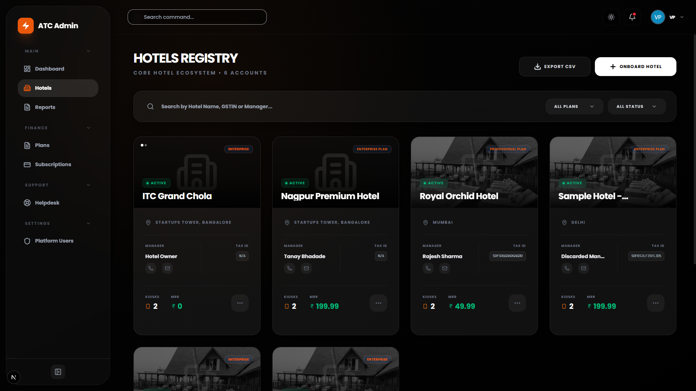

#### Purpose
View, search, and filter all hotels registered on the platform.

#### Page Layout
- **Page Title:** HOTELS REGISTRY · *Core Hotel Ecosystem • N Accounts*
- **Top Actions:** `EXPORT CSV` button · `+ ONBOARD HOTEL` button (orange)
- **Filter Bar:** Search input "Search by Hotel Name, GSTIN or Manager..." · `ALL PLANS` dropdown · `ALL STATUS` dropdown
- **Hotel Cards Grid:** 2-column card layout (responsive). Each card shows:
  - Hotel property photo (or placeholder icon if unavailable)
  - Plan badge (top right corner: e.g., ENTERPRISE, PROFESSIONAL PLAN, ENTERPRISE PLAN)
  - Status badge: 🟢 ACTIVE or 🔴 SUSPENDED
  - Hotel name (large)
  - Location (city)
  - Manager name with phone/email icon links
  - Tax ID
  - **KIOSKS** count (orange icon) · **MRR** amount (₹)
  - `⋯` (three-dot) overflow menu (per card)

#### Procedure

| Step | Action |
|---|---|
| 1 | Click **Hotels** in the sidebar. |
| 2 | To search: type hotel name, GSTIN, or manager name in the search bar. Results filter in real time. |
| 3 | To filter by plan: click **ALL PLANS** dropdown and select a plan tier. |
| 4 | To filter by status: click **ALL STATUS** dropdown and select ACTIVE, SUSPENDED, etc. |
| 5 | To view a hotel: click its card. Navigate to Hotel Detail page. |
| 6 | To access quick actions on a hotel card: click `⋯` (three-dot menu) on the card. |
| 7 | To export the hotel list: click **EXPORT CSV** (top right). |
| 8 | To onboard a new hotel: click **+ ONBOARD HOTEL** (see SOP-SA-04). |

---

### SOP-SA-04: Onboarding a New Hotel

| Field | Value |
|---|---|
| **SOP ID** | SOP-SA-04 |
| **Role** | Super Admin |
| **Trigger** | Click **+ ONBOARD HOTEL** on the Hotels Registry page |

#### Purpose
Register a new hotel on the HMS Foundation platform, assign a subscription plan, and activate the hotel workspace.

#### Pre-conditions
- Hotel trade name, address, GSTIN (if applicable), PAN, and manager contact details are available.
- A subscription plan has been defined in the Product Catalog (SOP-SA-11).

#### Procedure

| Step | Action |
|---|---|
| 1 | Navigate to **Hotels** → click **+ ONBOARD HOTEL** (top-right, orange button). |
| 2 | In the onboarding form/modal (not separately screenshotted — inferred from Edit Hotel modal fields): enter **Trade Name**, **Registered Address**, **State Code**, **GSTIN**, and **PAN**. |
| 3 | Under **SUBSCRIPTION TIER**, select the appropriate plan: Enterprise Plan (₹199.99/mo), Professional Plan (₹49.99/mo), Starter (₹10/mo), or Enterprise (₹0/mo for custom). |
| 4 | Under **PRIMARY CONTACT**: enter **Manager Name**, **Mobile**, and **Email**. |
| 5 | Click **SAVE CHANGES** (or equivalent submit button). |
| 6 | The hotel appears in the Hotels Registry as a new card with its status set to ACTIVE (or a pending onboarding state). The dashboard's Active Hotels counter updates. |

> **⚠ Note:** The actual Onboard Hotel flow uses a form/modal similar to the Edit Hotel Details Modal (SOP-SA-08). The subscription tier selection, primary contact, address, and tax fields are identical.

---

### SOP-SA-05: Viewing Hotel Details — Overview Tab

| Field | Value |
|---|---|
| **SOP ID** | SOP-SA-05 |
| **Role** | Super Admin |
| **Trigger** | Click a hotel card from the Hotels Registry |

#### Screenshot Overview
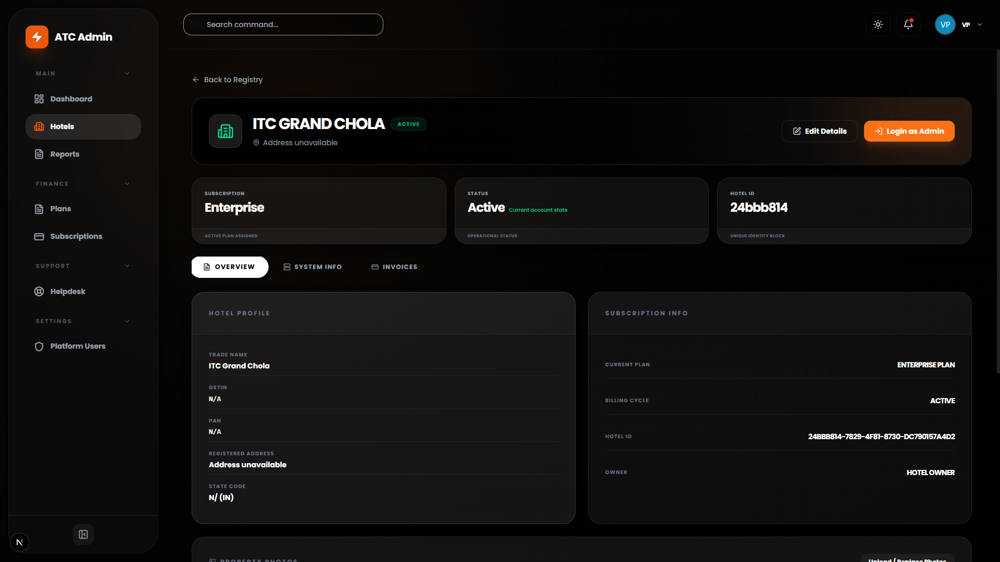
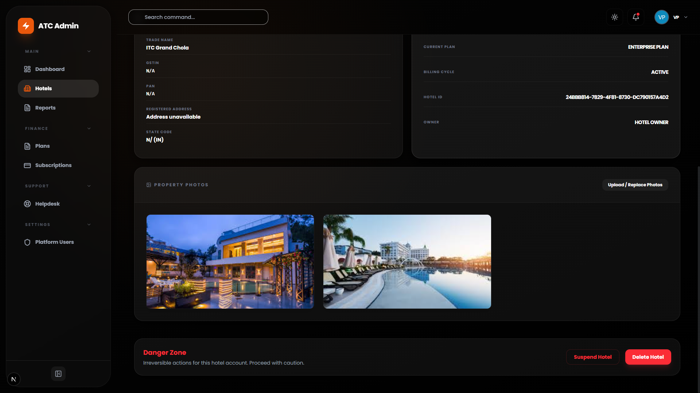

#### Purpose
Review a hotel's full profile: subscription, operational status, hotel profile data (trade name, GSTIN, PAN, address, state code), subscription info, property photos, and danger zone actions.

#### Page Layout

**Header:**
- Back navigation: ← Back to Registry
- Hotel name (large, bold) · Status badge (ACTIVE)
- Address line
- **Edit Details** button (secondary) · **→ Login as Admin** button (orange)

**Three Status Cards:**
| Card | What It Shows |
|---|---|
| **SUBSCRIPTION** | Active plan name (e.g., Enterprise). Footer: "ACTIVE PLAN ASSIGNED". |
| **STATUS** | Operational status (Active). Footer: "OPERATIONAL STATUS". |
| **HOTEL ID** | Short Hotel ID (e.g., 24bbb814). Footer: "UNIQUE IDENTITY BLOCK". |

**Three Tabs:**
`OVERVIEW` | `SYSTEM INFO` | `INVOICES`

**OVERVIEW Tab Content:**

*Hotel Profile card (left):*
- Trade Name
- GSTIN
- PAN
- Registered Address
- State Code

*Subscription Info card (right):*
- Current Plan
- Billing Cycle
- Hotel ID (full UUID)
- Owner

*Property Photos section (bottom):*
- Grid of hotel property photos
- **Upload / Replace Photos** button

*Danger Zone (very bottom):*
- Warning text: *"Irreversible actions for this hotel account. Proceed with caution."*
- **Suspend Hotel** button (text, red) · **Delete Hotel** button (filled, red)

#### Procedure

| Step | Action |
|---|---|
| 1 | From Hotels Registry, click the target hotel's card. |
| 2 | Review the three Status Cards at the top for a quick health snapshot. |
| 3 | In the **Hotel Profile** card, verify trade name, GSTIN, PAN, address, and state code. |
| 4 | In the **Subscription Info** card, confirm plan tier, billing cycle, and owner assignment. |
| 5 | Scroll down to review **Property Photos**. Click **Upload / Replace Photos** to update them if needed. |
| 6 | Do NOT interact with the Danger Zone unless following SOP-SA-09. |

---

### SOP-SA-06: Viewing Hotel Details — System Info Tab

| Field | Value |
|---|---|
| **SOP ID** | SOP-SA-06 |
| **Role** | Super Admin |
| **Trigger** | On Hotel Detail page → click **SYSTEM INFO** tab |

#### Screenshot Overview
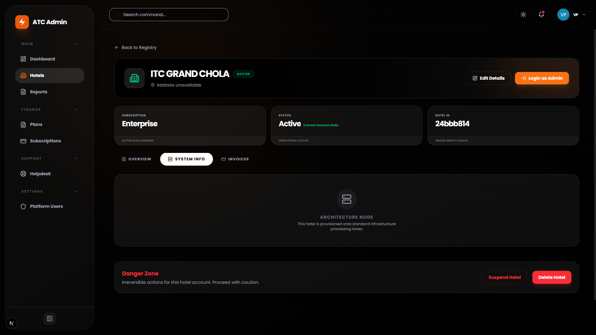

#### Purpose
Verify the infrastructure node assignment for a hotel's operational environment.

#### Tab Content
- **Architecture Node** section:
  - Icon: server node icon
  - Label: ARCHITECTURE NODE
  - Description: *"This hotel is provisioned onto standard infrastructure processing lanes."*

#### When to Use
- When a hotel reports connectivity or kiosk synchronization issues.
- When verifying that a hotel is correctly assigned to the infrastructure (standard vs. dedicated processing lanes).

#### Procedure

| Step | Action |
|---|---|
| 1 | Open Hotel Detail page for the target hotel. |
| 2 | Click the **SYSTEM INFO** tab. |
| 3 | Review the Architecture Node assignment and note whether it is "standard" or a dedicated lane. |
| 4 | If the hotel needs to be migrated to a dedicated lane, escalate to platform engineering. |

---

### SOP-SA-07: Viewing Hotel Details — Invoices Tab

| Field | Value |
|---|---|
| **SOP ID** | SOP-SA-07 |
| **Role** | Super Admin |
| **Trigger** | On Hotel Detail page → click **INVOICES** tab |

#### Screenshot Overview
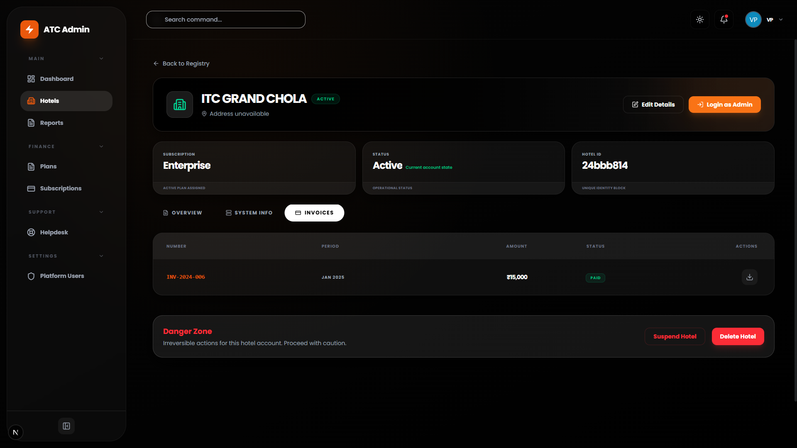

#### Purpose
View and download subscription invoices for a specific hotel.

#### Tab Content — Invoice Table

| Column | Description |
|---|---|
| **NUMBER** | Invoice identifier (e.g., INV-2024-006) — displayed in orange, clickable |
| **PERIOD** | Billing month (e.g., JAN 2025) |
| **AMOUNT** | Invoice amount in INR (e.g., ₹15,000) |
| **STATUS** | Payment status badge (PAID — green, or UNPAID — red) |
| **ACTIONS** | Download icon (⬇) to download invoice as PDF |

#### Procedure

| Step | Action |
|---|---|
| 1 | Open Hotel Detail page → click **INVOICES** tab. |
| 2 | Review the invoice table for billing history. |
| 3 | To download an invoice: click the ⬇ download icon in the ACTIONS column for the target row. |
| 4 | If an invoice shows UNPAID status: navigate to Subscription Hub (SOP-SA-13) or contact hotel admin for follow-up. |

---

### SOP-SA-08: Editing Hotel Details

| Field | Value |
|---|---|
| **SOP ID** | SOP-SA-08 |
| **Role** | Super Admin |
| **Trigger** | On Hotel Detail page → click **Edit Details** button |

#### Screenshot Overview
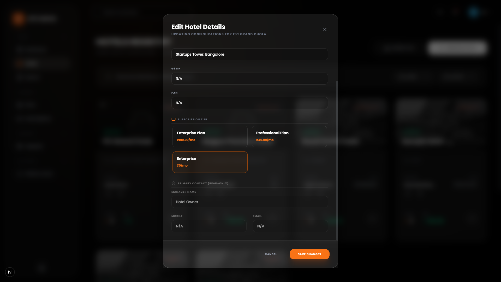

#### Purpose
Update a hotel's registered address, tax information (GSTIN/PAN), subscription tier, and primary contact details.

#### Modal Layout
**Title:** Edit Hotel Details · *"UPDATING CONFIGURATIONS FOR [HOTEL NAME]"*

**Sections:**
1. **Registered Address** — text input
2. **GSTIN** — text input
3. **PAN** — text input
4. **SUBSCRIPTION TIER** — tile selector:
   - Enterprise Plan · ₹199.99/mo
   - Professional Plan · ₹49.99/mo
   - Enterprise · ₹0/mo (custom, selected state shown with orange border)
5. **PRIMARY CONTACT (READ-ONLY):**
   - Manager Name — read-only text field
   - Mobile — read-only
   - Email — read-only

**Footer:** **CANCEL** · **SAVE CHANGES** (orange)

#### Procedure

| Step | Action |
|---|---|
| 1 | Navigate to Hotel Detail → click **Edit Details**. |
| 2 | Update **Registered Address** if changed. |
| 3 | Update **GSTIN** and **PAN** if provided by the hotel. |
| 4 | Under SUBSCRIPTION TIER, click the desired plan tile to switch the hotel's subscription. Only one tile can be selected at a time. |
| 5 | Note: PRIMARY CONTACT fields are read-only in this modal. To change manager contact, a separate user management flow is required. |
| 6 | Click **SAVE CHANGES** to apply. Or click **CANCEL** to discard. |

---

### SOP-SA-09: Suspending or Deleting a Hotel

| Field | Value |
|---|---|
| **SOP ID** | SOP-SA-09 |
| **Role** | Super Admin |
| **Trigger** | On Hotel Detail → Overview Tab → Danger Zone section |

#### Purpose
Take irreversible administrative action on a hotel account — either temporarily suspending it or permanently deleting it.

> **⚠ CAUTION — IRREVERSIBLE ACTIONS. These operations cannot be undone without manual database intervention. Follow internal approval workflow before proceeding.**

#### Pre-conditions
- Approval received from platform operations manager.
- Hotel has been notified (for suspension) or has a 30-day deactivation notice (for deletion).
- Outstanding invoices have been settled or recorded.

#### Procedure — Suspend Hotel

| Step | Action |
|---|---|
| 1 | Navigate to Hotel Detail → Overview Tab → scroll to **Danger Zone**. |
| 2 | Click **Suspend Hotel** (outlined red button). |
| 3 | A confirmation dialog will appear (inferred). Confirm suspension. |
| 4 | Hotel status changes from ACTIVE → SUSPENDED. Hotel Admin users lose access. Kiosks go offline. |
| 5 | Note the incident in the support/helpdesk record. |

#### Procedure — Delete Hotel

| Step | Action |
|---|---|
| 1 | Navigate to Hotel Detail → Overview Tab → scroll to **Danger Zone**. |
| 2 | Click **Delete Hotel** (filled red button). |
| 3 | A confirmation dialog appears requiring typed confirmation (inferred). |
| 4 | All hotel data, kiosks, room data, and subscription records are permanently removed. |
| 5 | Hotel disappears from Hotels Registry. MRR is recalculated. |

---

### SOP-SA-10: Impersonating a Hotel Admin (Login as Admin)

| Field | Value |
|---|---|
| **SOP ID** | SOP-SA-10 |
| **Role** | Super Admin |
| **Trigger** | On Hotel Detail page → click **→ Login as Admin** (orange button, top-right) |

#### Purpose
Allow Super Admin to access a specific hotel's HMS Hotel admin panel to troubleshoot, review, or configure the hotel environment on behalf of the hotel's staff.

#### Pre-conditions
- Valid reason for impersonation (support ticket, onboarding walkthrough, audit).
- Log the impersonation activity in the helpdesk record.

#### Procedure

| Step | Action |
|---|---|
| 1 | Navigate to Hotel Detail for the target hotel. |
| 2 | Click **→ Login as Admin** (orange, top-right header). |
| 3 | The Super Admin is redirected to the Hotel Admin panel (`/hotel/dashboard`) for that specific hotel. |
| 4 | Take necessary actions (room configuration, billing check, onboarding setup). |
| 5 | To return to the Super Admin panel, click the back button or sign out and re-authenticate. |

> **Note:** All actions performed during impersonation are attributed to the session and may appear in the hotel's audit log.

---

### SOP-SA-11: Managing Subscription Plans (Product Catalog)

| Field | Value |
|---|---|
| **SOP ID** | SOP-SA-11 |
| **Role** | Super Admin |
| **Trigger** | Click **Plans** in left sidebar (FINANCE section) |

#### Screenshot Overview
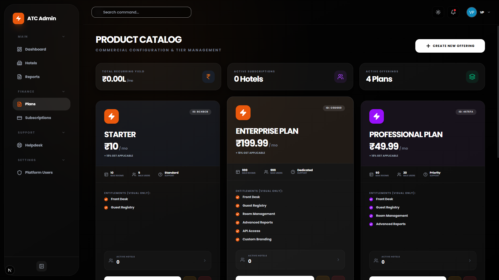

#### Purpose
View, manage, and publish subscription plans (product offerings) available to hotels on the platform.

#### Page Layout
**Title:** PRODUCT CATALOG · *Commercial Configuration & Tier Management*

**KPI Summary (3 cards):**
| Card | Info |
|---|---|
| Total Recurring Yield | MRR across all subscriptions (₹0.00L/mo) |
| Active Subscriptions | Number of hotels with active plans |
| Active Offerings | Total published plan count (e.g., 4 Plans) |

**Plan Cards (grid):** Each plan card displays:
- Plan Icon (orange bolt)
- Plan ID badge (top right, e.g., ID: BC4BCB)
- Plan Name (e.g., STARTER, ENTERPRISE PLAN, PROFESSIONAL PLAN)
- Monthly Price (e.g., ₹10/mo, ₹199.99/mo, ₹49.99/mo)
- "+ 18% GST APPLICABLE"
- **Limits:** MAX ROOMS · MAX USERS · SUPPORT TIER
- **Entitlements (Visual Only):** Feature badges (Front Desk, Guest Registry, Room Management, Advanced Reports, API Access, Custom Branding)
- **Active Hotels** count linked to that plan
- Action buttons (edit/delete at card footer — inferred from page pattern)

**Current Plans:**
| Plan | Price | Max Rooms | Max Users | Support |
|---|---|---|---|---|
| STARTER | ₹10/mo | 10 | 5 | Standard |
| ENTERPRISE PLAN | ₹199.99/mo | 999 | 999 | Dedicated |
| PROFESSIONAL PLAN | ₹49.99/mo | 50 | 20 | Priority |
| ENTERPRISE (Custom) | ₹0/mo | — | — | — |

#### Procedure — View Plans

| Step | Action |
|---|---|
| 1 | Click **Plans** in the sidebar. |
| 2 | Review the KPI cards for total recurring yield and active subscription count. |
| 3 | Browse plan cards. Note which plans have active hotel subscriptions (shown in the plan footer). |
| 4 | To create a new plan: click **+ CREATE NEW OFFERING** (top right). Follow SOP-SA-12. |

---

### SOP-SA-12: Creating a New Subscription Plan

| Field | Value |
|---|---|
| **SOP ID** | SOP-SA-12 |
| **Role** | Super Admin |
| **Trigger** | On Product Catalog → click **+ CREATE NEW OFFERING** |

#### Screenshot Overview
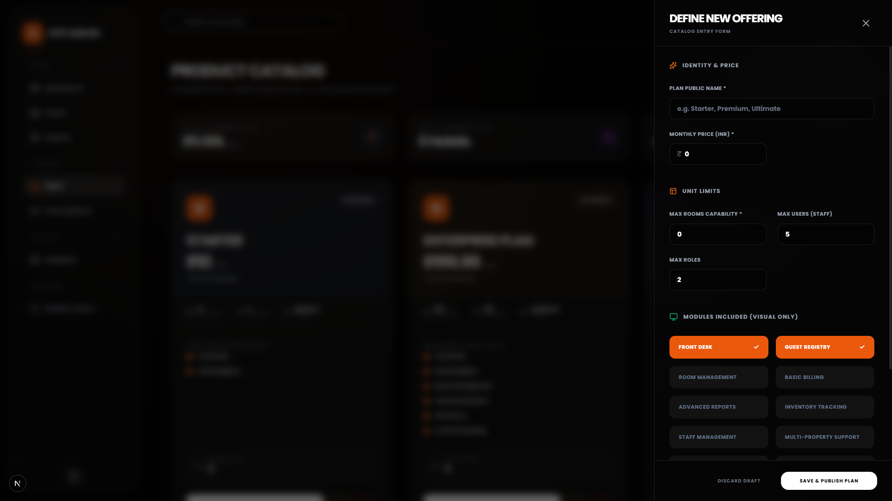

#### Purpose
Define and publish a new subscription tier with pricing, unit limits, and module entitlements.

#### Side Panel Layout
**Title:** DEFINE NEW OFFERING · *Catalog Entry Form*

**Section 1 — Identity & Price:**
- **Plan Public Name** — text input (e.g., "Starter, Premium, Ultimate")
- **Monthly Price (INR)** — number input (₹ prefix)

**Section 2 — Unit Limits:**
- **Max Rooms Capability** — number input
- **Max Users (Staff)** — number input
- **Max Roles** — number input

**Section 3 — Modules Included (Visual Only):**
Toggleable module tiles (orange = selected, dark = not selected):
- Front Desk · Guest Registry · Room Management · Basic Billing
- Advanced Reports · Inventory Tracking · Staff Management · Multi-Property Support
- (additional modules scrollable below)

**Footer:** **DISCARD DRAFT** · **SAVE & PUBLISH PLAN** (orange)

#### Procedure

| Step | Action |
|---|---|
| 1 | On Product Catalog page, click **+ CREATE NEW OFFERING**. |
| 2 | Enter the **Plan Public Name** (the name hotels will see). |
| 3 | Enter the **Monthly Price (INR)**. (18% GST is applied automatically on top.) |
| 4 | Set **Max Rooms Capability**, **Max Users**, and **Max Roles** to define plan limits. |
| 5 | Toggle the **Modules Included** tiles to define which features are visually highlighted for this plan. |
| 6 | Click **SAVE & PUBLISH PLAN** to publish, or **DISCARD DRAFT** to cancel. |
| 7 | The new plan appears as a card in the Product Catalog. |

---

### SOP-SA-13: Viewing the Subscription Hub

| Field | Value |
|---|---|
| **SOP ID** | SOP-SA-13 |
| **Role** | Super Admin |
| **Trigger** | Click **Subscriptions** in left sidebar (FINANCE section) |

#### Screenshot Overview
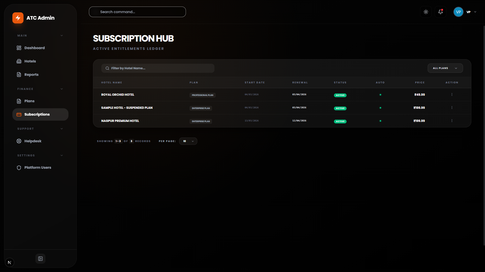

#### Purpose
View the active entitlements ledger — all hotels with active subscriptions, their plan, billing dates, renewal status, and pricing.

#### Page Layout
**Title:** SUBSCRIPTION HUB · *Active Entitlements Ledger*

**Table Columns:**
| Column | Description |
|---|---|
| HOTEL NAME | Name of the subscribed hotel |
| PLAN | Plan tier badge (e.g., PROFESSIONAL PLAN, ENTERPRISE PLAN) |
| START DATE | Subscription start date (DD/MM/YYYY) |
| RENEWAL | Next renewal date (DD/MM/YYYY) |
| STATUS | Status badge (ACTIVE — green) |
| AUTO | Dot indicator (auto-renewal on/off) |
| PRICE | Monthly price (₹) |
| ACTION | `⋯` overflow menu |

**Filter:** `Filter by Hotel Name...` search box · `ALL PLANS` dropdown (top right)

**Pagination:** "Showing 1-3 of 3 records · Per page: 10"

#### Procedure

| Step | Action |
|---|---|
| 1 | Click **Subscriptions** in the sidebar. |
| 2 | Review the table for all active subscriptions. |
| 3 | Check STATUS column — any non-ACTIVE rows need attention. |
| 4 | Check RENEWAL dates for upcoming renewals. |
| 5 | Click `⋯` on a row to manage that hotel's subscription (cancel, change plan — inferred). |
| 6 | Use **Filter by Hotel Name** or **ALL PLANS** to narrow results. |

---

### SOP-SA-14: Managing Platform Users (Access Control)

| Field | Value |
|---|---|
| **SOP ID** | SOP-SA-14 |
| **Role** | Super Admin |
| **Trigger** | Click **Platform Users** in left sidebar (SETTINGS section) |

#### Screenshot Overview
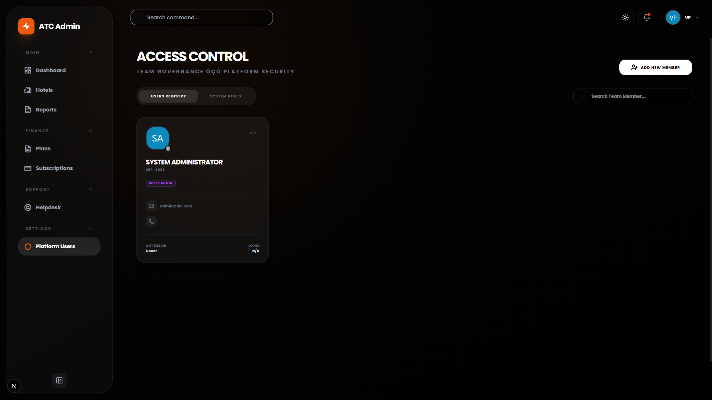

#### Purpose
View, invite, and manage Super Admin-level platform users (staff members who have access to the ATC Admin panel).

#### Page Layout
**Title:** ACCESS CONTROL · *Team Governance • Platform Security*

**Two Tabs:**
- **USERS REGISTRY** (default) — shows platform users
- **SYSTEM ROLES** — shows role definitions (see SOP-SA-16)

**Top Actions:** **ADD NEW MEMBER** button (outlined) · **Search Team Member...** input

**User Cards:**
Each card shows:
- Avatar initials + status dot (green = online, grey = offline)
- Full Name (e.g., SYSTEM ADMINISTRATOR)
- User ID (USR-0001)
- Role badge (e.g., SUPER ADMIN)
- Email address
- Phone (if set)
- LAST SESSION date · JOINED date

#### Procedure

| Step | Action |
|---|---|
| 1 | Click **Platform Users** in the sidebar → **USERS REGISTRY** tab. |
| 2 | Browse existing team members. |
| 3 | Click `⋯` on a user card for options: Edit, Remove (inferred). |
| 4 | To add a new platform user: click **ADD NEW MEMBER** and complete the invite form. |
| 5 | To search for a specific user: use the **Search Team Member...** field. |

---

### SOP-SA-15: Editing a Platform User Identity

| Field | Value |
|---|---|
| **SOP ID** | SOP-SA-15 |
| **Role** | Super Admin |
| **Trigger** | On Access Control → Users Registry → click `⋯` on a user card → select Edit |

#### Screenshot Overview
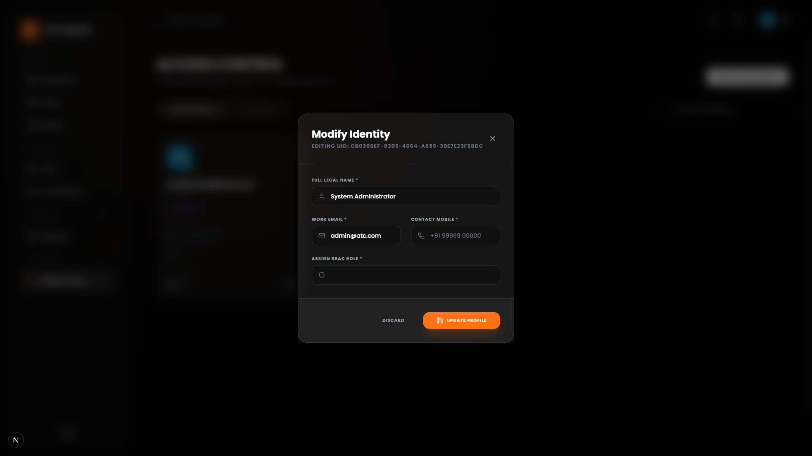

#### Purpose
Update a platform user's name, contact information, and RBAC role assignment.

#### Modal Layout
**Title:** Modify Identity · *"EDITING UID: [UUID]"*

**Fields:**
- **Full Legal Name** — text input
- **Work Email** — email input
- **Contact Mobile** — phone input (format: +91 XXXXX XXXXX)
- **Assign RBAC Role** — dropdown/selector (role picker)

**Footer:** **DISCARD** · **UPDATE PROFILE** (orange)

#### Procedure

| Step | Action |
|---|---|
| 1 | In Users Registry, click `⋯` on the target user → select Edit (or directly click the edit action). |
| 2 | Update **Full Legal Name** if changed. |
| 3 | Update **Work Email** if changed (note: this affects login). |
| 4 | Update **Contact Mobile** if applicable. |
| 5 | In **Assign RBAC Role**, select the appropriate system role from the dropdown. |
| 6 | Click **UPDATE PROFILE** to save, or **DISCARD** to cancel. |

---

### SOP-SA-16: Managing System Roles and Permission Matrix

| Field | Value |
|---|---|
| **SOP ID** | SOP-SA-16 |
| **Role** | Super Admin |
| **Trigger** | On Access Control → click **SYSTEM ROLES** tab |

#### Screenshot Overview
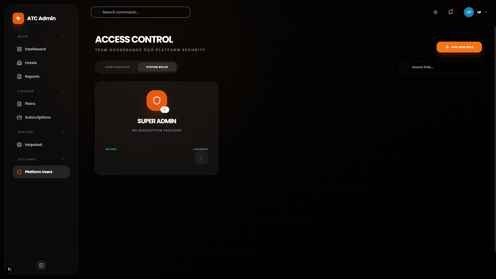
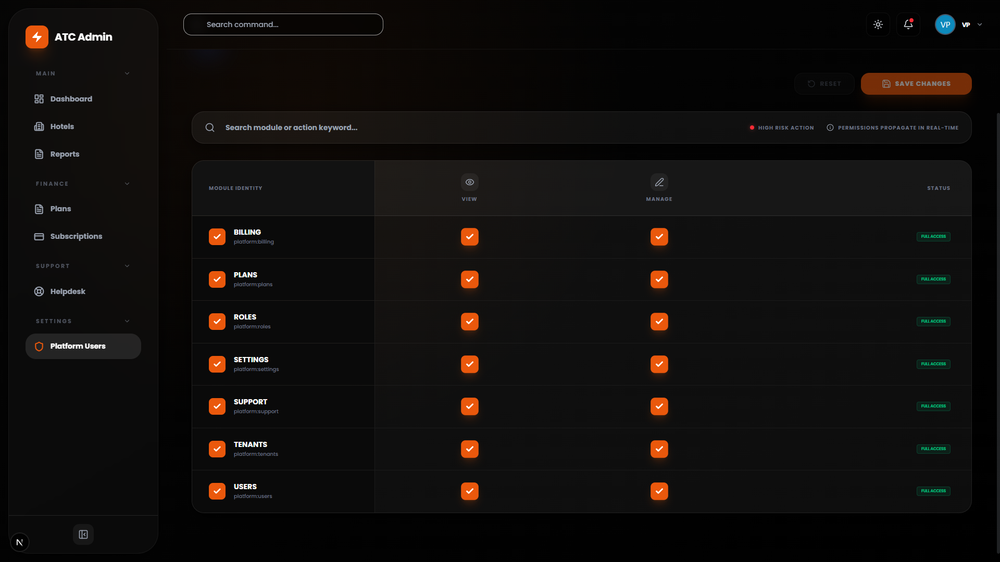

#### Purpose
Define and manage the platform-level roles and their granular module permissions (VIEW / MANAGE).

#### System Roles Tab
- **+ ADD NEW ROLE** button (top right)
- Role cards grid:
  - **SUPER ADMIN** (shown) — 0 members currently assigned
  - Role status: ACTIVE · Members count · `⋯` overflow menu

#### Permission Matrix
When a role is selected for editing, a full permission matrix page opens:

**Matrix Structure:**
| Column | Description |
|---|---|
| MODULE IDENTITY | Module name (e.g., BILLING, PLANS, ROLES, SETTINGS, SUPPORT, TENANTS, USERS) + permission key (e.g., `platform:billing`) |
| VIEW | Checkbox — allows read access to the module |
| MANAGE | Checkbox — allows write/administrative access |
| STATUS | "FULL ACCESS" badge when both VIEW + MANAGE are checked |

**Platform Modules:**
`BILLING` · `PLANS` · `ROLES` · `SETTINGS` · `SUPPORT` · `TENANTS` · `USERS`

**Legend:** 🔴 HIGH RISK ACTION (indicated in the matrix header) · ⏰ PERMISSIONS PROPAGATE IN REAL-TIME

**Actions:** **RESET** (outlined) · **SAVE CHANGES** (orange, top right)

#### Procedure — Edit Role Permissions

| Step | Action |
|---|---|
| 1 | Navigate to Access Control → **SYSTEM ROLES** tab. |
| 2 | Click `⋯` on the target role card → select Edit Permissions. |
| 3 | The Permission Matrix page opens for that role. |
| 4 | Toggle **VIEW** and **MANAGE** checkboxes per module as required. |
| 5 | Note: ⚠ Permissions marked as HIGH RISK ACTION (red dot) have platform-wide security implications. |
| 6 | Click **SAVE CHANGES**. Changes take effect in real-time for all users assigned to this role. |
| 7 | To undo all unsaved changes: click **RESET**. |

---

### SOP-SA-17: Exporting Reports from the Intelligence Hub

| Field | Value |
|---|---|
| **SOP ID** | SOP-SA-17 |
| **Role** | Super Admin |
| **Trigger** | Click **Reports** in the left sidebar (MAIN section) |

#### Screenshot Overview
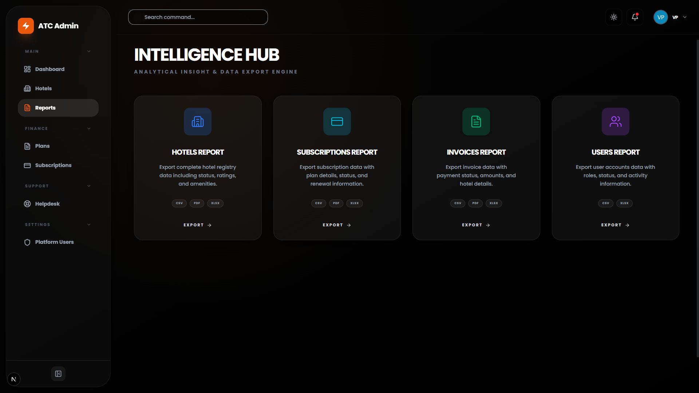

#### Purpose
Access the platform-wide data export engine to generate and download reports on hotels, subscriptions, invoices, and users.

#### Page Layout
**Title:** INTELLIGENCE HUB · *Analytical Insight & Data Export Engine*

**Report Cards (4):**

| Report | Description | Formats |
|---|---|---|
| **Hotels Report** | Complete hotel registry data including status, ratings, and amenities | CSV · PDF · XLSX |
| **Subscriptions Report** | Subscription data with plan details, status, and renewal information | CSV · PDF · XLSX |
| **Invoices Report** | Invoice data with payment status, amounts, and hotel details | CSV · PDF · XLSX |
| **Users Report** | User accounts data with roles, status, and activity information | CSV · XLSX |

Each card has an **EXPORT →** button.

#### Procedure

| Step | Action |
|---|---|
| 1 | Click **Reports** in the sidebar. |
| 2 | Identify the report type needed (Hotels, Subscriptions, Invoices, or Users). |
| 3 | Click **EXPORT →** on the desired report card. |
| 4 | The Report Detail page opens (see SOP-SA-18), showing the actual data table before download. |
| 5 | On the detail page, choose format (PDF or Excel) and click the export button. |

---

### SOP-SA-18: Viewing a Report Detail (Hotels Registry Export)

| Field | Value |
|---|---|
| **SOP ID** | SOP-SA-18 |
| **Role** | Super Admin |
| **Trigger** | On Intelligence Hub → click **EXPORT →** on a report card |

#### Screenshot Overview
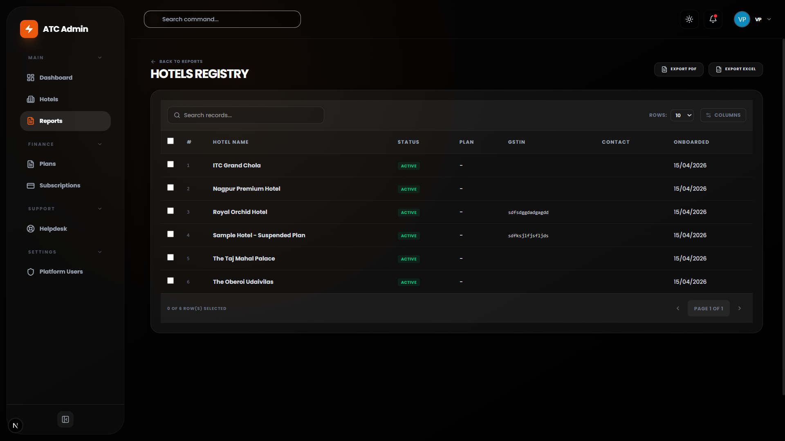

#### Purpose
Preview the report data in a tabular view and export it in the chosen format.

#### Page Layout (Hotels Registry Example)
- **← BACK TO REPORTS** link
- **Page Title:** HOTELS REGISTRY
- **Top Actions:** **EXPORT PDF** · **EXPORT EXCEL** buttons (top right)
- **Data Table:**
  - Search records input · ROWS selector (10/25/50) · COLUMNS picker
  - Columns: # · HOTEL NAME · STATUS · PLAN · GSTIN · CONTACT · ONBOARDED
  - Row checkboxes for bulk selection
  - Pagination: "N of N ROW(S) SELECTED · Page 1 of 1"

#### Procedure

| Step | Action |
|---|---|
| 1 | From Intelligence Hub, click **EXPORT →** on the Hotels Report card. |
| 2 | Use the **Search records...** box to filter by hotel name if needed. |
| 3 | Use **COLUMNS** picker to choose which columns to include. |
| 4 | Adjust **ROWS** per page if needed. |
| 5 | Check row checkboxes for selective export (or leave all unchecked for full export). |
| 6 | Click **EXPORT PDF** for a PDF document or **EXPORT EXCEL** for an XLSX spreadsheet. |

---

### SOP-SA-19: Managing Helpdesk Support Tickets (Super Admin)

| Field | Value |
|---|---|
| **SOP ID** | SOP-SA-19 |
| **Role** | Super Admin |
| **Trigger** | Click **Helpdesk** in left sidebar (SUPPORT section) |

#### Screenshot Overview
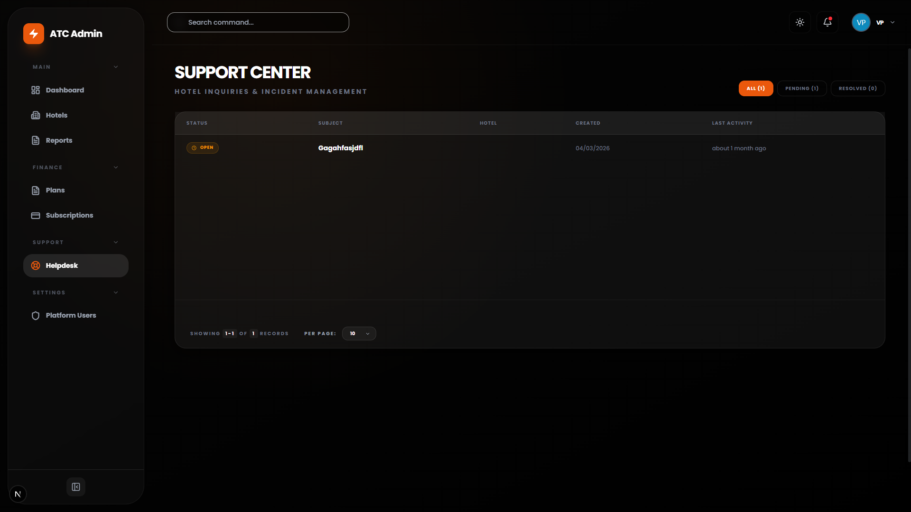

#### Purpose
View, triage, and resolve support tickets submitted by hotels through their Hotel Admin panel.

#### Page Layout
**Title:** SUPPORT CENTER · *Hotel Inquiries & Incident Management*

**Filter Tabs:** **ALL (N)** · **PENDING (N)** · **RESOLVED (0)**

**Ticket Table Columns:**
| Column | Description |
|---|---|
| STATUS | OPEN (orange badge) / PENDING / RESOLVED |
| SUBJECT | Ticket subject line |
| HOTEL | Hotel name that submitted the ticket |
| CREATED | Date submitted (DD/MM/YYYY) |
| LAST ACTIVITY | Relative time (e.g., "about 1 month ago") |

#### Procedure

| Step | Action |
|---|---|
| 1 | Click **Helpdesk** in the sidebar. |
| 2 | Review tickets under **ALL** tab (default). Current count shows "PENDING (1)" — one ticket awaiting action. |
| 3 | Click **PENDING** tab to focus on unactioned tickets. |
| 4 | Click a ticket row to open the ticket detail (ticket detail view not screenshotted). |
| 5 | Respond, update status, or resolve the ticket from the detail view. |
| 6 | Resolved tickets move to the **RESOLVED** tab. |

---

### SOP-SA-20: Editing Super Admin Account Settings

| Field | Value |
|---|---|
| **SOP ID** | SOP-SA-20 |
| **Role** | Super Admin |
| **Trigger** | Click avatar/initials (top-right) → Account Settings, or navigate to `/super/profile` |

#### Screenshot Overview
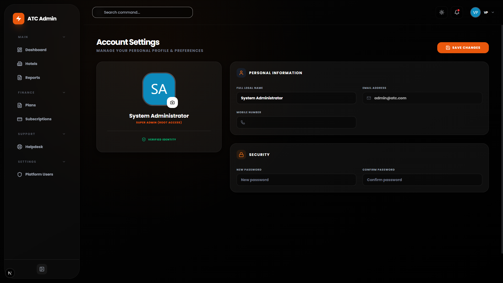

#### Purpose
Update the Super Admin's personal profile information and change their account password.

#### Page Layout
**Title:** Account Settings · *Manage your personal profile & preferences*

**Left Card (Identity):**
- Avatar with camera icon overlay (uploads a new profile photo)
- Name: System Administrator
- Role: SUPER ADMIN (ROOT ACCESS)
- ✅ VERIFIED IDENTITY badge

**Right Section — Personal Information:**
- Full Legal Name — editable text field
- Email Address — read-only (set by the system)
- Mobile Number — phone icon field

**Right Section — Security:**
- New Password — password field
- Confirm Password — password field

**Top Action:** **SAVE CHANGES** (orange button)

#### Procedure

| Step | Action |
|---|---|
| 1 | Navigate to Account Settings (via avatar dropdown or profile link). |
| 2 | To update name: edit the **Full Legal Name** field. |
| 3 | To update mobile: enter a new number in the **Mobile Number** field. |
| 4 | To change password: enter a new password in **New Password**, then confirm it in **Confirm Password**. |
| 5 | To update avatar photo: click the camera icon on the avatar. |
| 6 | Click **SAVE CHANGES** (top right). |

---

## Part C — Hotel Admin SOPs

---

### SOP-HA-01: Reading the Hotel Admin Property Overview Dashboard

| Field | Value |
|---|---|
| **SOP ID** | SOP-HA-01 |
| **Role** | Hotel Admin / General Manager |
| **Trigger** | Log in as Hotel Admin, or click **Dashboard** in the left sidebar |

#### Screenshot Overview
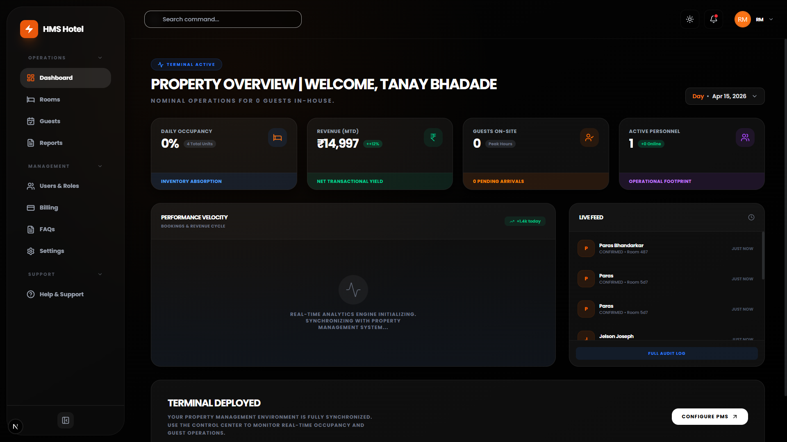

#### Purpose
Monitor the real-time operational health of the property: occupancy, revenue, guests in-house, active staff, booking activity feed, and PMS terminal status.

#### Dashboard Widgets Explained

**Page Title:** PROPERTY OVERVIEW | WELCOME, [MANAGER NAME]  
Sub-title: "NOMINAL OPERATIONS FOR N GUESTS IN-HOUSE."  
**Terminal Status Badge:** 🔵 TERMINAL ACTIVE  
**Date Selector:** Day • Apr 15, 2026

**Top KPI Cards (4):**

| KPI Card | What It Shows |
|---|---|
| **Daily Occupancy** | % occupancy rate · "N Total Units" · Sub-label: INVENTORY ABSORPTION |
| **Revenue (MTD)** | Month-to-date revenue in ₹ · % change from last period · Sub-label: NET TRANSACTIONAL YIELD |
| **Guests On-Site** | Current guests physically present on property · "Peak Hours" indicator · Sub-label: N PENDING ARRIVALS |
| **Active Personnel** | Count of staff currently online · "+N Online" · Sub-label: OPERATIONAL FOOTPRINT |

**Bottom Left — Performance Velocity:**
- Sub-label: BOOKINGS & REVENUE CYCLE
- Line chart showing bookings + revenue cycle trends
- "+1.4k today" indicator (booking velocity)
- When the analytics engine is initializing: Shows "REAL-TIME ANALYTICS ENGINE INITIALIZING. SYNCHRONIZING WITH PROPERTY MANAGEMENT SYSTEM..."

**Bottom Right — Live Feed:**
- Real-time booking activity log
- Each row: guest initials avatar · Guest Name · "CONFIRMED • Room [ID]" · "JUST NOW" timestamp
- **FULL AUDIT LOG** button links to complete booking history

**Bottom — Terminal Deployed Banner:**
- Message: *"YOUR PROPERTY MANAGEMENT ENVIRONMENT IS FULLY SYNCHRONIZED. USE THE CONTROL CENTER TO MONITOR REAL-TIME OCCUPANCY AND GUEST OPERATIONS."*
- **CONFIGURE PMS →** button (links to PMS configuration)

#### Procedure — Daily Operations Check

| Step | Action |
|---|---|
| 1 | Log in as Hotel Admin. Dashboard loads automatically. |
| 2 | Check **Daily Occupancy** — if 0%, verify room inventory in the Rooms module. |
| 3 | Check **Revenue (MTD)** and compare to target. |
| 4 | Check **Guests On-Site** and confirm pending arrivals count. |
| 5 | Check **Active Personnel** — ensure required staff are online. |
| 6 | Review the **Live Feed** for recent confirmed bookings. |
| 7 | If Analytics Engine shows "INITIALIZING" — wait for sync to complete (usually seconds). If persists > 5 minutes, contact platform support. |

---

### SOP-HA-02: Managing Room Types

| Field | Value |
|---|---|
| **SOP ID** | SOP-HA-02 |
| **Role** | Hotel Admin / General Manager |
| **Trigger** | Click **Rooms** in left sidebar (OPERATIONS section) |

#### Screenshot Overview
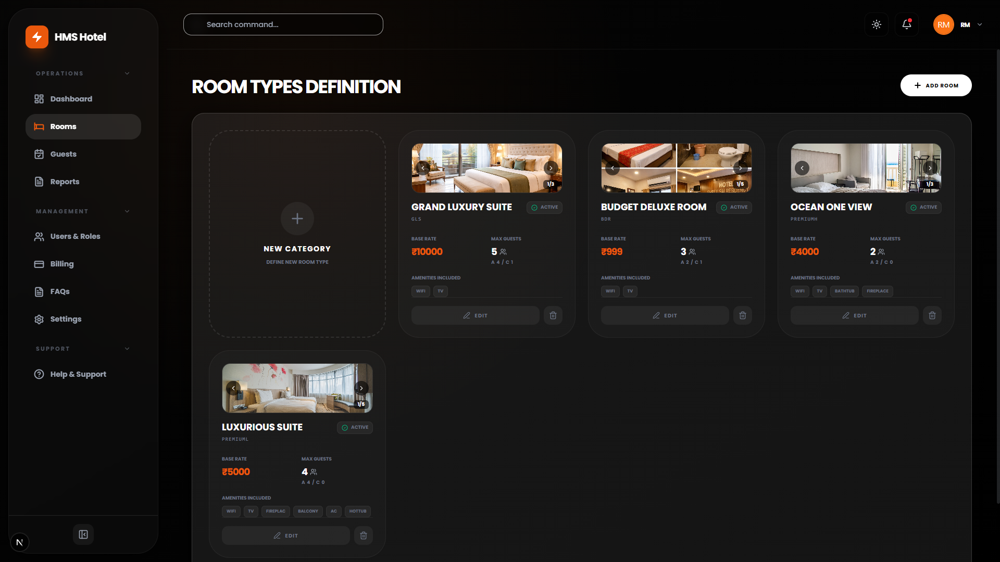

#### Purpose
Define, view, edit, and remove the property's room type categories used for bookings and kiosk configuration.

#### Page Layout
**Title:** ROOM TYPES DEFINITION  
**Top Action:** **+ ADD ROOM** button (top right)

**Room Type Cards Grid:**

Each card displays:
- Room photos (carousel: 1/N images shown, prev/next arrows)
- Room Type Name (e.g., GRAND LUXURY SUITE)
- Room Code (e.g., GLS, BDR, PREMIUMB)
- Status badge: 🟢 ACTIVE
- **Base Rate** — price in ₹ (e.g., ₹10000, ₹999, ₹4000, ₹5000)
- **Max Guests** — adults count / children count
- **Amenities Included** — tag badges (WIFI, TV, BATHTUB, FIREPLACE, BALCONY, AC, HOTTUB)
- **✏ EDIT** button · **🗑 Delete** button (trash icon)

**First card slot** is always the **"NEW CATEGORY — Define New Room Type"** placeholder card (dashed border + icon).

#### Current Room Types (from screenshot):
| Name | Code | Rate | Max Guests | Amenities |
|---|---|---|---|---|
| Grand Luxury Suite | GLS | ₹10,000 | 5 (A4/C1) | WiFi, TV |
| Budget Deluxe Room | BDR | ₹999 | 3 (A2/C1) | WiFi, TV |
| Ocean One View | PREMIUMB | ₹4,000 | 2 (A2/C0) | WiFi, TV, Bathtub, Fireplace |
| Luxurious Suite | PREMIUML | ₹5,000 | 4 (A4/C0) | WiFi, TV, Fireplace, Balcony, AC, Hottub |

#### Procedure — Edit a Room Type

| Step | Action |
|---|---|
| 1 | Click **Rooms** in the sidebar. |
| 2 | Locate the room type card to edit. |
| 3 | Click **✏ EDIT** below the card. |
| 4 | The Edit Room form/modal opens (fields mirror the create form — see SOP-HA-03). |
| 5 | Update required fields (rate, max guests, amenities, photos). |
| 6 | Save changes. |

#### Procedure — Delete a Room Type

| Step | Action |
|---|---|
| 1 | Locate the room type card. |
| 2 | Click the **🗑 (trash)** icon. |
| 3 | Confirm deletion in the confirmation dialog. |
| 4 | The room type is removed from inventory and kiosk menus. |

> **⚠ Warning:** Deleting a room type with active bookings may cause booking inconsistencies. Verify no active bookings exist for this room type before deleting.

---

### SOP-HA-03: Adding a New Room Type

| Field | Value |
|---|---|
| **SOP ID** | SOP-HA-03 |
| **Role** | Hotel Admin / General Manager |
| **Trigger** | On Room Types page → click **+ ADD ROOM**, or click the dashed **NEW CATEGORY** placeholder card |

#### Purpose
Create a new room category that will be available for bookings and displayed on kiosk screens.

#### Inferred Form Fields (based on existing card data)
- Room Type Name (public name)
- Room Code (short identifier, e.g., GLS, BDR)
- Base Rate (₹ per night)
- Max Adults / Max Children
- Amenities (multi-select: WiFi, TV, AC, Bathtub, Fireplace, Balcony, Hottub, etc.)
- Room Photos (upload multiple images)
- Status (Active/Inactive toggle)

#### Procedure

| Step | Action |
|---|---|
| 1 | Click **+ ADD ROOM** or the **NEW CATEGORY** placeholder card. |
| 2 | Enter **Room Type Name** and **Room Code**. |
| 3 | Set the **Base Rate** (₹ per night). |
| 4 | Set **Max Adults** and **Max Children** counts. |
| 5 | Select all applicable **Amenities** for this room type. |
| 6 | Upload at least one **Room Photo**. |
| 7 | Set Status to **Active** to make it bookable immediately. |
| 8 | Save. The new room type card appears in the grid. |

---

### SOP-HA-04: Managing Guest Bookings

| Field | Value |
|---|---|
| **SOP ID** | SOP-HA-04 |
| **Role** | Hotel Admin / General Manager |
| **Trigger** | Click **Guests** in left sidebar (OPERATIONS section) |

#### Screenshot Overview
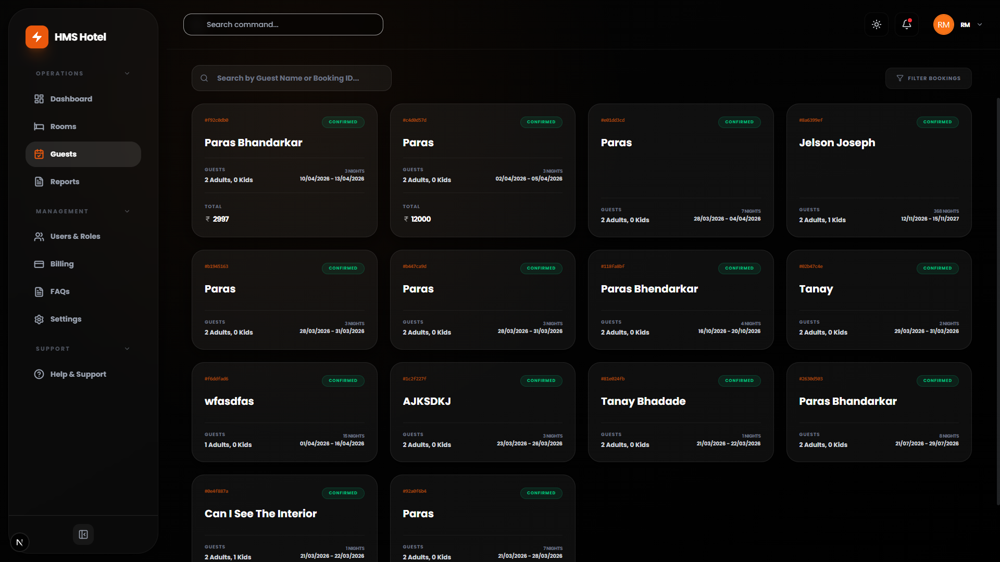

#### Purpose
View all guest bookings (past, current, upcoming), search by guest name or booking ID, and apply booking filters.

#### Page Layout
- **Search Bar:** *"Search by Guest Name or Booking ID..."*
- **FILTER BOOKINGS** button (top right, with filter icon)
- **Booking Cards Grid** (2–4 columns, card layout)

**Each Booking Card shows:**
- Booking ID (e.g., #f92c0db0) — displayed in orange, short hash
- Status badge (CONFIRMED — teal green)
- Guest First Name (large bold)
- **GUESTS:** Adults count, Kids count
- **Dates:** Check-in → Check-out (DD/MM/YYYY format)
- **NIGHTS:** Count
- **TOTAL:** ₹ amount

#### Procedure — Find a Booking

| Step | Action |
|---|---|
| 1 | Click **Guests** in the sidebar. |
| 2 | To search a specific guest or booking: type in the **Search by Guest Name or Booking ID...** bar. |
| 3 | To filter by date range, status, room type: click **FILTER BOOKINGS** and apply filters in the filter panel. |
| 4 | Click a booking card to open the booking detail view (detail view not separately screenshotted). |

#### Procedure — Create a New Booking

> **Note:** No "Add Booking" button is visible in the screenshot — this may be handled through the kiosk terminal or through a booking creation modal inside the Guest detail. Confirm with platform documentation.

---

### SOP-HA-05: Viewing Occupancy Analysis Reports

| Field | Value |
|---|---|
| **SOP ID** | SOP-HA-05 |
| **Role** | Hotel Admin / General Manager |
| **Trigger** | Click **Reports** in left sidebar (OPERATIONS section) → select Occupancy Analysis |

#### Screenshot Overview
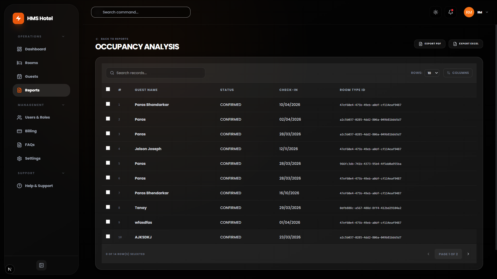

#### Purpose
Analyze all booking records with check-in dates, guest details, status, and room type assignments. Export data for external analysis or compliance.

#### Page Layout
- **← Back to Reports** navigation
- **Page Title:** OCCUPANCY ANALYSIS
- **Export:** **EXPORT PDF** · **EXPORT EXCEL** (top right)
- **Data Table:**

| Column | Description |
|---|---|
| # | Row number |
| GUEST NAME | Guest's name |
| STATUS | Booking status (CONFIRMED) |
| CHECK-IN | Check-in date (DD/MM/YYYY) |
| ROOM TYPE ID | UUID of the assigned room type |

- **Search records...** box · **ROWS** selector · **COLUMNS** picker
- **Pagination:** "0 of 14 ROW(S) SELECTED · Page 1 of 2"

#### Procedure

| Step | Action |
|---|---|
| 1 | Click **Reports** in sidebar. |
| 2 | Select **Occupancy Analysis** report. |
| 3 | Review the booking data table. Check-in dates, guest names, and room type assignments are visible. |
| 4 | Use **Search records...** to filter by a specific guest name. |
| 5 | Use COLUMNS picker to add/remove columns. |
| 6 | Click **EXPORT PDF** or **EXPORT EXCEL** to download the report. |
| 7 | For bulk actions, check row checkboxes and perform batch operations. |

---

### SOP-HA-06: Managing the Billing & Commercial Ecosystem

| Field | Value |
|---|---|
| **SOP ID** | SOP-HA-06 |
| **Role** | Hotel Admin / General Manager |
| **Trigger** | Click **Billing** in left sidebar (MANAGEMENT section) |

#### Screenshot Overview
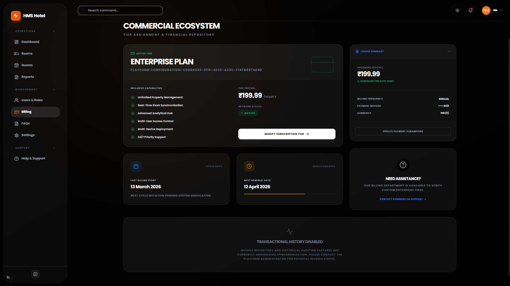

#### Purpose
View the hotel's active subscription tier, billing details, renewal dates, payment method, and modify tier if needed.

#### Page Layout
**Title:** COMMERCIAL ECOSYSTEM · *Tier Assignment & Financial Repository*

**Active Tier Card (full-width, top):**
- "ACTIVE TIER" label
- Plan Name (e.g., ENTERPRISE PLAN)
- Platform Configuration ID (UUID)
- **Inclusive Capabilities** list:
  - Unlimited Property Management
  - Real-Time Kiosk Synchronization
  - Advanced Analytical Hub
  - Multi-User Access Control
  - Multi-Device Deployment
  - 24/7 Priority Support
- **Tier Pricing:** ₹199.99 /YEARLY
- **Network Status:** ACTIVE badge
- **MODIFY SUBSCRIPTION TIER →** button (outlined)

**Right Mini-Panel — Ledger Summary:**
- Upcoming Invoice: ₹199.99 · "SCHEDULED FOR AUTO-DEBIT"
- Billing Frequency: ANNUAL
- Payment Method: •••• 4421
- Currency: INR (₹)
- **UPDATE PAYMENT PARAMETERS** button

**Bottom Three Cards:**
| Card | Info |
|---|---|
| Cycle Data | Last Billing Event date · "Next cycle initiation pending system verification" |
| Health Registry | Next Renewal Date |
| Need Assistance? | "CONTACT COMMERCIAL SUPPORT →" link |

**Transactional History (bottom):**
- Note: "TRANSACTIONAL HISTORY DISABLED — Invoice Repository and Historical Auditing features are currently undergoing synchronization. Please contact the platform administrator for physical invoice copies."

#### Procedure — View Billing Status

| Step | Action |
|---|---|
| 1 | Click **Billing** in the sidebar. |
| 2 | Review the Active Tier card for current plan and capabilities. |
| 3 | In the Ledger Summary panel, verify the upcoming invoice amount and auto-debit status. |
| 4 | Check the **Next Renewal Date** in the Health Registry card. |
| 5 | If payment method needs updating: click **UPDATE PAYMENT PARAMETERS**. |

#### Procedure — Modify Subscription Tier

| Step | Action |
|---|---|
| 1 | Click **MODIFY SUBSCRIPTION TIER →** in the Active Tier card. |
| 2 | Select the new plan from the available options. |
| 3 | Confirm the change. The new plan takes effect from the next billing cycle (or immediately, per plan terms). |
| 4 | If you need a custom enterprise tier: click **CONTACT COMMERCIAL SUPPORT →** in the Assistance card. |

---

### SOP-HA-07: Managing the FAQ Knowledge Base

| Field | Value |
|---|---|
| **SOP ID** | SOP-HA-07 |
| **Role** | Hotel Admin / General Manager |
| **Trigger** | Click **FAQs** in left sidebar (MANAGEMENT section) |

#### Screenshot Overview
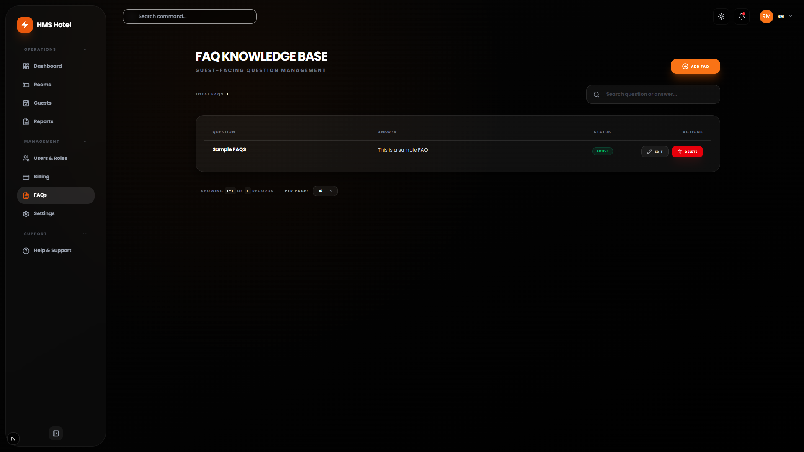

#### Purpose
Manage guest-facing FAQ entries that are displayed on kiosk screens for self-service guest assistance.

#### Page Layout
**Title:** FAQ KNOWLEDGE BASE · *Guest-Facing Question Management*

**Top:** "TOTAL FAQs: N" · **Search question or answer...** input · **+ ADD FAQ** button (orange)

**FAQ Table:**
| Column | Description |
|---|---|
| QUESTION | The FAQ question text |
| ANSWER | Short answer text |
| STATUS | ACTIVE (green badge) |
| ACTIONS | **EDIT** button (pencil icon) · **DELETE** button (red, trash icon) |

**Pagination:** Per page selector

#### Procedure

| Step | Action |
|---|---|
| 1 | Click **FAQs** in the sidebar. |
| 2 | Review existing FAQs in the table. |
| 3 | To search: type in **Search question or answer...** box to filter entries. |
| 4 | To add a new FAQ: click **+ ADD FAQ** (follow SOP-HA-08). |
| 5 | To edit an existing FAQ: click **EDIT** in the ACTIONS column for that row. Modify and save. |
| 6 | To delete an FAQ: click **DELETE** (red). Confirm deletion. The FAQ is removed from kiosk screens immediately. |

---

### SOP-HA-08: Adding a New FAQ Entry

| Field | Value |
|---|---|
| **SOP ID** | SOP-HA-08 |
| **Role** | Hotel Admin / General Manager |
| **Trigger** | On FAQ Knowledge Base → click **+ ADD FAQ** |

#### Screenshot Overview
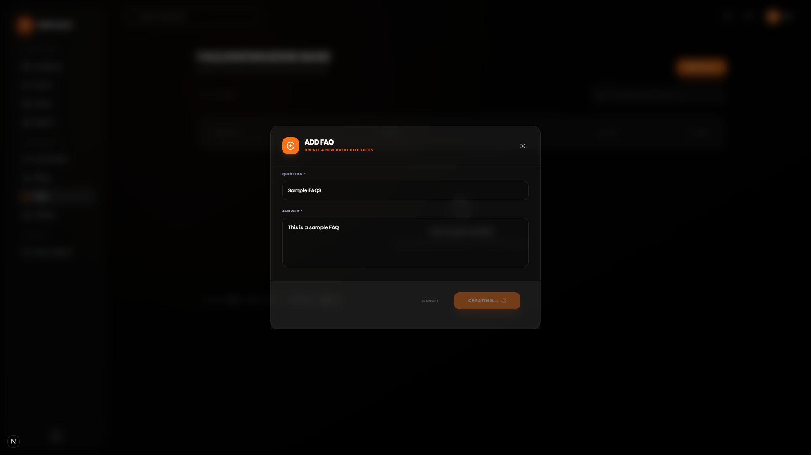

#### Purpose
Create a new guest-facing FAQ entry to display on property kiosk screens for self-service assistance.

#### Modal Layout
**Title:** ADD FAQ · *CREATE A NEW GUEST HELP ENTRY*

**Fields:**
- **Question** * — text input (required)
- **Answer** * — textarea (required)

**Footer:** **CANCEL** · **CREATING...** (submit button — orange, with spinner when submitting)

#### Procedure

| Step | Action |
|---|---|
| 1 | On FAQ Knowledge Base page, click **+ ADD FAQ**. |
| 2 | In the **Question** field, enter the guest-facing question clearly (e.g., "What time is check-out?"). |
| 3 | In the **Answer** field, enter the complete answer. |
| 4 | Click the orange submit button (labelled **CREATING...** when in progress). |
| 5 | On success, the modal closes and the new FAQ appears in the table with ACTIVE status. |
| 6 | To cancel: click **CANCEL** to discard the entry. |

---

### SOP-HA-09: Managing Hotel Staff — Users & Roles (Team Sovereignty)

| Field | Value |
|---|---|
| **SOP ID** | SOP-HA-09 |
| **Role** | Hotel Admin / General Manager |
| **Trigger** | Click **Users & Roles** in left sidebar (MANAGEMENT section) |

#### Screenshot Overview
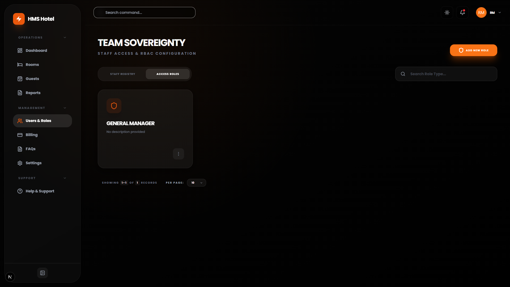
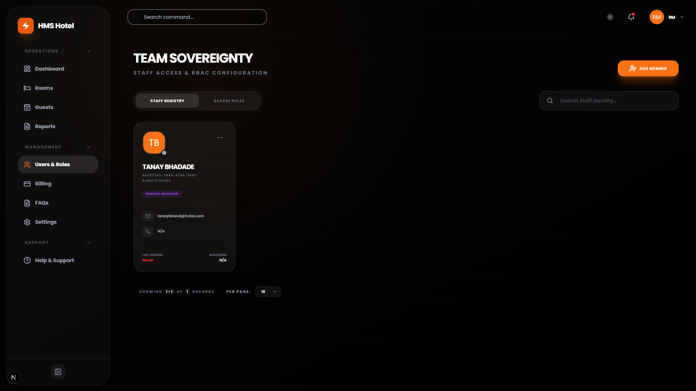

#### Purpose
View, invite, and manage hotel staff members (Staff Registry) and define their access roles (Access Roles).

#### Page Layout
**Title:** TEAM SOVEREIGNTY · *Staff Access & RBAC Configuration*

**Two Tabs:**
- **STAFF REGISTRY** — view and manage staff members
- **ACCESS ROLES** — view and manage hotel roles

**Staff Registry Tab:**
- **ADD MEMBER** button (top right)
- **Search Staff identity...** input
- **Staff Cards:** Each card shows:
  - Avatar initials + online status dot
  - Full Name (e.g., TANAY BHADADE)
  - Employee UUID
  - Role badge (e.g., GENERAL MANAGER)
  - Email address · Phone number
  - LAST SESSION · REGISTERED date
  - `⋯` overflow menu

**Access Roles Tab:**
- **ADD NEW ROLE** button (top right)
- **Search Role Type...** input
- **Role Cards:** Each card shows:
  - Role icon (shield)
  - Role Name (e.g., GENERAL MANAGER)
  - Description (or "No description provided")
  - `⋯` overflow menu

#### Procedure — Add a New Staff Member

| Step | Action |
|---|---|
| 1 | Click **Users & Roles** → **STAFF REGISTRY** tab. |
| 2 | Click **ADD MEMBER**. |
| 3 | Complete the new member form: Full Name, Work Email, Contact Mobile, Assign Role. |
| 4 | Save. The new member card appears in the Staff Registry. |
| 5 | The invited staff member receives a login email (inferred). |

#### Procedure — Add a New Access Role

| Step | Action |
|---|---|
| 1 | Click **Users & Roles** → **ACCESS ROLES** tab. |
| 2 | Click **ADD NEW ROLE**. |
| 3 | Enter Role Name and Description. |
| 4 | Save. The new role card appears in the grid. |
| 5 | Configure permissions for this role (SOP-HA-10). |

---

### SOP-HA-10: Configuring Access Roles & Permission Matrix (Hotel)

| Field | Value |
|---|---|
| **SOP ID** | SOP-HA-10 |
| **Role** | Hotel Admin / General Manager |
| **Trigger** | On Users & Roles → Access Roles tab → click `⋯` on a role → Edit Permissions |

#### Screenshot Overview
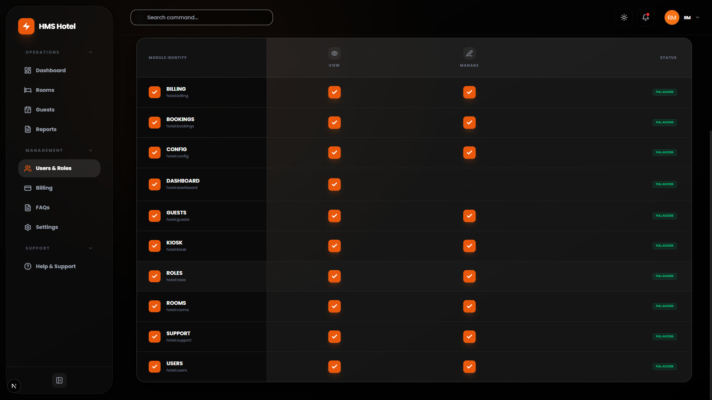

#### Purpose
Define granular VIEW and MANAGE permissions per hotel module for each staff role.

#### Permission Matrix — Hotel Modules

| Module | Permission Key | VIEW | MANAGE |
|---|---|---|---|
| BILLING | hotel:billing | ✅ | ✅ |
| BOOKINGS | hotel:bookings | ✅ | ✅ |
| CONFIG | hotel:config | ✅ | ✅ |
| DASHBOARD | hotel:dashboard | ✅ | — |
| GUESTS | hotel:guests | ✅ | ✅ |
| KIOSK | hotel:kiosk | ✅ | ✅ |
| ROLES | hotel:roles | ✅ | ✅ |
| ROOMS | hotel:rooms | ✅ | ✅ |
| SUPPORT | hotel:support | ✅ | ✅ |
| USERS | hotel:users | ✅ | ✅ |

*All modules shown as FULL ACCESS for the General Manager role.*

#### Procedure

| Step | Action |
|---|---|
| 1 | Navigate to **Users & Roles** → **ACCESS ROLES** tab → click `⋯` on the target role → select Edit / View Permissions. |
| 2 | The Permission Matrix loads for that role. |
| 3 | Toggle **VIEW** checkbox per module to control read access. |
| 4 | Toggle **MANAGE** checkbox to control write/administrative access. |
| 5 | If both VIEW and MANAGE are enabled, the STATUS column shows "FULL ACCESS". |
| 6 | Click **SAVE CHANGES**. Permissions propagate in real-time. |
| 7 | To undo: click **RESET** before saving. |

---

### SOP-HA-11: Configuring Hotel Settings (Kiosk Support Contacts)

| Field | Value |
|---|---|
| **SOP ID** | SOP-HA-11 |
| **Role** | Hotel Admin / General Manager |
| **Trigger** | Click **Settings** in left sidebar (MANAGEMENT section) |

#### Screenshot Overview
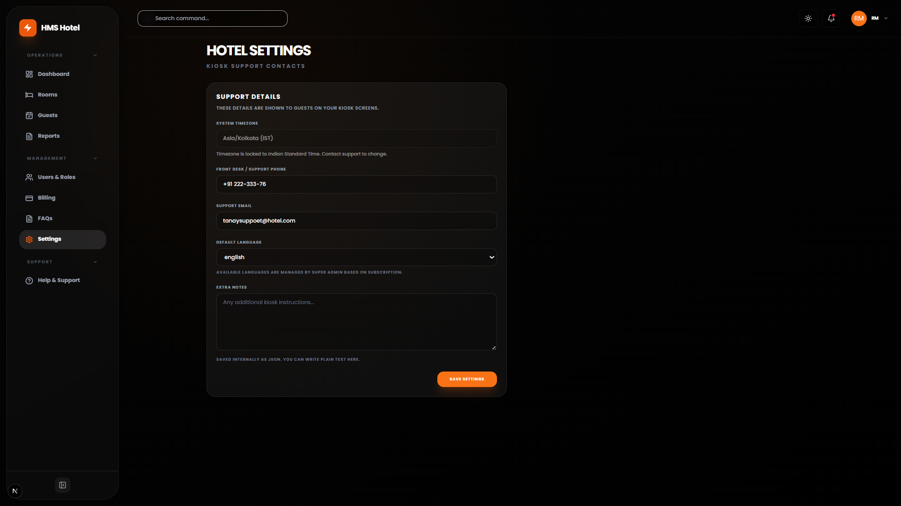

#### Purpose
Configure hotel-level settings shown to guests on kiosk screens: support phone, support email, language, and additional instructions.

#### Page Layout
**Title:** HOTEL SETTINGS · *Kiosk Support Contacts*

**Section — Support Details:**
> *"These details are shown to guests on your kiosk screens."*

| Field | Description |
|---|---|
| SYSTEM TIMEZONE | Locked to Asia/Kolkata (IST). Read-only — "Timezone is locked to Indian Standard Time. Contact support to change." |
| FRONT DESK / SUPPORT PHONE | Editable phone number (e.g., +91 222-333-76) |
| SUPPORT EMAIL | Editable email (e.g., tanaysupport@hotel.com) |
| DEFAULT LANGUAGE | Dropdown selector (e.g., "english"). Note: "Available languages are managed by Super Admin based on subscription." |
| EXTRA NOTES | Textarea for additional kiosk instructions. Saved internally as JSON; plain text is accepted. |

**Footer:** **SAVE SETTINGS** button (orange)

#### Procedure

| Step | Action |
|---|---|
| 1 | Click **Settings** in the sidebar. |
| 2 | Update **Front Desk / Support Phone** with the hotel's current front desk number. |
| 3 | Update **Support Email** with the hotel support email address. |
| 4 | In **Default Language** dropdown, select the primary guest language for kiosk displays. |
| 5 | In **Extra Notes**, enter any additional instructions for guests (shown on kiosk). |
| 6 | Click **SAVE SETTINGS** to apply. Settings update on kiosk screens on next sync. |

> **Note:** The timezone cannot be changed from this screen. Submit a support ticket if timezone change is needed.

---

### SOP-HA-12: Raising a Support Ticket to the Platform Team

| Field | Value |
|---|---|
| **SOP ID** | SOP-HA-12 |
| **Role** | Hotel Admin / General Manager |
| **Trigger** | Click **Help & Support** in left sidebar (SUPPORT section) |

#### Screenshot Overview
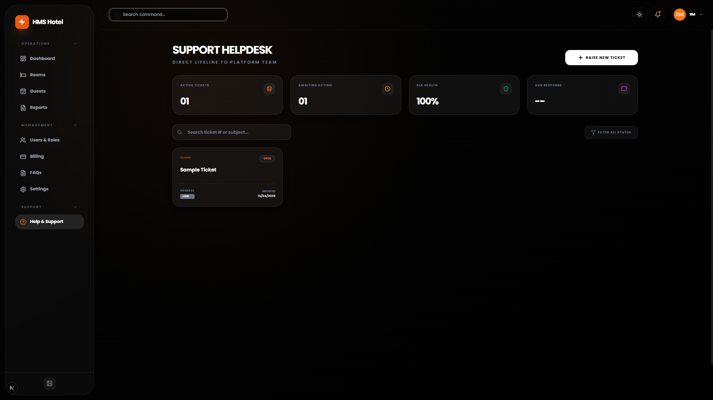
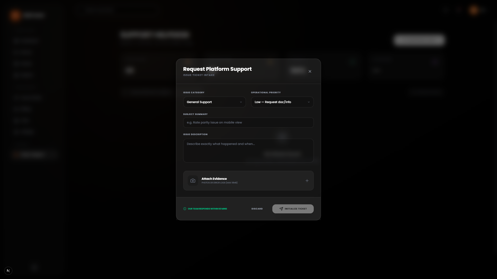

#### Purpose
Submit a support request directly to the ATC platform team for billing issues, kiosk problems, subscription queries, or technical incidents.

#### Support Page Layout
**Title:** SUPPORT HELPDESK · *Direct Lifeline to Platform Team*

**KPI Summary (4 cards):**
| Card | Info |
|---|---|
| ACTIVE TICKETS | Total open tickets |
| AWAITING ACTION | Tickets needing hotel admin response |
| SLA HEALTH | % SLA compliance (100% shown) |
| AVG RESPONSE | Average response time |

**Ticket List:**
- **Search ticket # or subject...** input
- **FILTER ALL STATUS** button
- **Ticket Cards** — each shows:
  - Ticket # (e.g., #1ce98k)
  - Status badge (OPEN)
  - Subject (e.g., "Sample Ticket")
  - Category tag (e.g., GENERAL)
  - Priority tag (LOW)
  - Reported date

**+ RAISE NEW TICKET** button (top right, white outlined)

#### Procedure — Raise a New Support Ticket

| Step | Action |
|---|---|
| 1 | Click **Help & Support** in the sidebar. |
| 2 | Review existing open tickets to see if the issue is already reported. |
| 3 | Click **+ RAISE NEW TICKET**. The New Ticket modal opens. |
| 4 | In the modal: enter **Subject**, **Category**, **Priority**, and a **Description** of the issue. |
| 5 | Submit the ticket. |
| 6 | The ticket appears in the Active Tickets list with OPEN status. |

#### Procedure — Track a Ticket

| Step | Action |
|---|---|
| 1 | Open Help & Support page. |
| 2 | Review the ticket list for status updates. |
| 3 | Click a ticket card to view the full thread / response from the platform team (detail view inferred). |

---

### SOP-HA-13: Editing Hotel Admin Staff Profile

| Field | Value |
|---|---|
| **SOP ID** | SOP-HA-13 |
| **Role** | Hotel Admin / Any Staff |
| **Trigger** | Click user avatar (top right) → Profile, or navigate to `/hotel/profile` |

#### Screenshot Overview
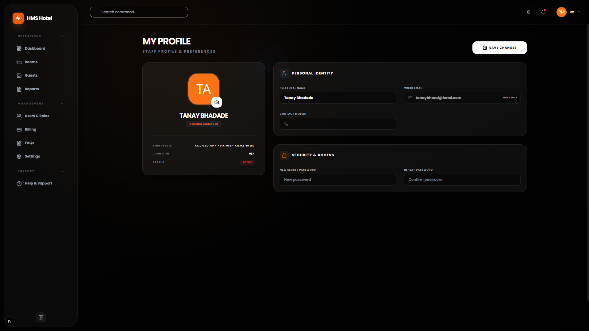

#### Purpose
Update a staff member's personal profile, work identity, and account password.

#### Page Layout
**Title:** MY PROFILE · *Staff Profile & Preferences*

**Left Card (Identity):**
- Avatar with camera overlay (to upload new photo)
- Full Name (e.g., TANAY BHADADE)
- Role badge (GENERAL MANAGER)
- Employee ID (UUID)
- Joined On date
- Status: ACTIVE

**Right — Personal Identity:**
- **Full Legal Name** — editable
- **Work Email** — read-only ("ADMIN ONLY" badge — can only be changed by hotel owner/Super Admin)
- **Contact Mobile** — editable

**Right — Security & Access:**
- **New Secret Password** — password field
- **Repeat Password** — confirm password field

**Top Action:** **SAVE CHANGES** (outlined button)

#### Procedure

| Step | Action |
|---|---|
| 1 | Navigate to My Profile (via avatar dropdown or sidebar). |
| 2 | To update your name: edit the **Full Legal Name** field. |
| 3 | To update your phone: edit **Contact Mobile**. |
| 4 | To change password: enter **New Secret Password** and **Repeat Password**. |
| 5 | To update avatar: click the camera icon on your avatar. |
| 6 | Click **SAVE CHANGES** to apply. |

> **Note:** Work Email is read-only and can only be changed by the Hotel Admin owner or Super Admin.

---

## Part D — Appendix

### Appendix A: Inferred Gaps (No Screenshots Available)

The following workflows are inferred from the UI but have no dedicated screenshots. These should be documented in a future sprint:

| Gap | Expected Location | Why Inferred |
|---|---|---|
| Hotel Onboarding Form (full) | Super Admin → Hotels → + ONBOARD HOTEL | Referenced in SOP-SA-04; only the Edit modal was screenshotted |
| Ticket Detail / Thread View | Both Super Admin Helpdesk and Hotel Support | Ticket list is visible; detail view for replying/resolving is not |
| Booking Detail / Guest Detail view | Hotel Admin → Guests → click booking card | Booking list is visible; individual booking modal/page not captured |
| Room Type Create/Edit Modal | Hotel Admin → Rooms → + ADD ROOM | Room cards visible; create/edit form not separately screenshotted |
| Hotel Admin Reports — Home Page | Hotel Admin → Reports (hub, not detail) | Reports detail (Occupancy Analysis) screenshotted; the report selection hub is not |
| New Staff Member Form | Hotel Admin → Users & Roles → ADD MEMBER | Staff list visible; invite/create form not screenshotted |
| Password Reset Flow | Login page | "Forgot password" link not visible in login screenshot |
| Kiosk Management Panel | May be in a separate module | Referenced in dashboard ("CONFIGURE PMS →") and permission matrix (hotel:kiosk) |
| Notification Center | Top-right bell icon on all pages | Bell visible; notification panel not captured |

---

### Appendix B: Glossary of Terms

| Term | Definition |
|---|---|
| **ATC Admin** | The Super Admin panel brand name used within the HMS platform |
| **HMS Hotel** | The Hotel Admin panel brand name for individual hotel workspaces |
| **MRR** | Monthly Recurring Revenue — total subscription revenue per month |
| **GSTIN** | Goods and Services Tax Identification Number (India) |
| **PAN** | Permanent Account Number (India tax identifier) |
| **RBAC** | Role-Based Access Control — system of assigning permissions to users via roles |
| **Kiosk** | Self-service guest-facing hardware terminal deployed at hotel properties |
| **Architecture Node** | The infrastructure lane/server group a hotel is provisioned onto |
| **PMS** | Property Management System — the hotel's core operational software connected to HMS |
| **SLA** | Service Level Agreement — response time commitment for support tickets |
| **MTD** | Month-to-Date — metric calculated from the start of the current month |
| **Entitlements** | Features included in a subscription plan (labeled "Visual Only" in HMS, meaning they appear on plan cards for marketing but enforcement is separately managed) |
| **Onboarding** | The process of registering and activating a new hotel on the platform |
| **Danger Zone** | Section on Hotel Detail page containing irreversible admin actions (Suspend/Delete) |
| **Terminal** | The PMS terminal status indicator on the Hotel Admin Dashboard (TERMINAL ACTIVE badge) |
| **Live Feed** | Real-time activity stream on dashboards showing booking events and system alerts |
| **Intelligence Hub** | The Super Admin reports center (INTELLIGENCE HUB) for data export |
| **Team Sovereignty** | HMS Hotel's brand name for the Users & Roles (staff management) section |
| **Commercial Ecosystem** | HMS Hotel's brand name for the Billing page |
| **Product Catalog** | Super Admin's brand name for the Plans page |
| **Subscription Hub** | Super Admin's brand name for the Subscriptions (active entitlements ledger) page |

---

*End of HMS Foundation Standard Operating Procedures — v1.0*  
*Document generated from reverse-engineering 33 UI screenshots (15 Super Admin + 14 Hotel Admin + 1 Login) across the full HMS Foundation platform.*
